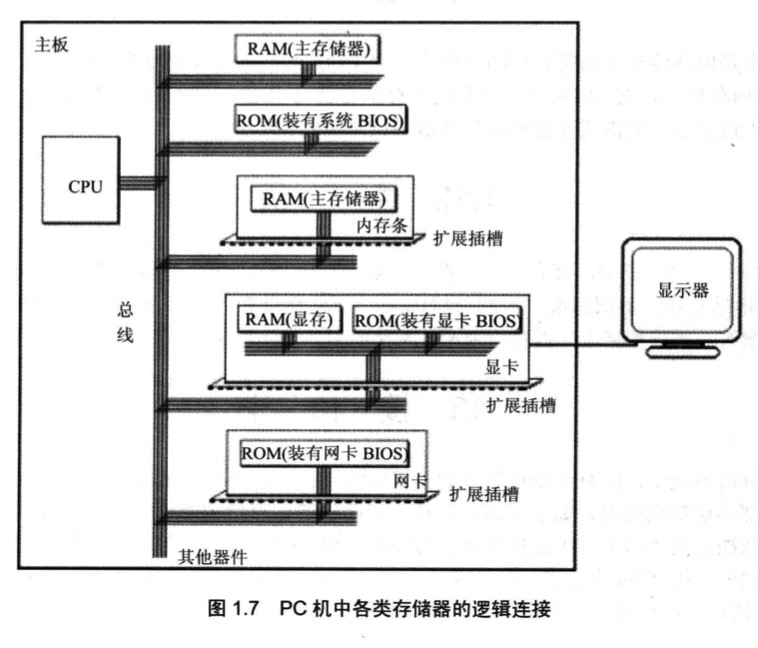
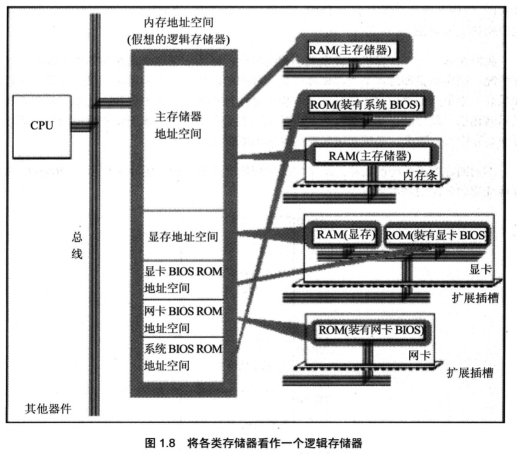

# 基础知识

汇编语言是直接在硬件之上工作的编程语言, 汇编的研究重点是如何利用硬件系统的编程结构和指令集有效灵活的控制系统工作

## 机器语言

机器语言是机器指令的集合. 机器指令是一列二进制数字, 计算机将其转变为一列高低电平, 以使计算机的点子器件受到驱动, 进行运算.

cpu: Center Processing Unit(中央处理单元), cpu是一种微处理器.

每一种cpu由于硬件设计和内部结构不同, 就需要不同的电平脉冲来控制. 每一种cpu都有自己的指令集, 也就是机器语言.

## 汇编语言
机器语言难于辨别和记忆, 所以产生了汇编语言

### 组成
1. 汇编指令: 机器码的助记符, 有对应的机器码
2. 伪指令: 没有对应的机器码, 有编译器执行, 计算机并不执行
3. 其他符号: 如+,-,*,/等, 有编译器识别, 没有对应的机器码

汇编语言的核心是汇编指令, 它决定了汇编语言的特性.

## 存储器
指令和数据在存储器(内存或磁盘)中存放

存储单元: 存储器被划分成若干个存储单元, 每个存储单元从0开始顺序编号, 这些编号是存储单元在存储器中的地址, 存储8个二进制位(1字节, 1Byte)

## cpu对存储器读写

`cpu`进行数据读写, 必须和外部芯片进行信息交互:

1. 地址信息(存储单元的地址)
2. 控制信息(存储器的选择, 读或写的命令)
3. 数据信息(读或写的数据)

在计算机中连接cpu和其他芯片的导线, 称为总线. 总线从物理上讲是一根根导线的集合, 根据传送信息的不同, 总线从逻辑上分为3类

1. 地址总线
2. 数据总线
3. 控制总线

### 地址总线
地址总线的宽度决定了cpu的寻址能力. 一个cpu有n根地址线, 则该cpu的地址总线宽度为n, 最多可以寻址2的n次方个内存单元

### 数据总线
数据总线宽度决定了cpu与其他器件进行数据传送时的一次性数据传送量. 16根总线一次可以传送2字节(16bit)

### 控制总线
cpu对外部器件的控制是通过控制总线来进行的. 这里控制总线是个总称. 控制总线是一些不同控制线的集合. 控制总线的宽度决定了cpu对系统中其他器件的控制能力

## 内存地址空间
对于cpu来讲, 系统中所有存储器中的存储单元都处于一个统一的逻辑存储器中.它的容量受cpu寻址能力的限制. 这个逻辑存储器就是内存地址空间.

1. 主板
    - 每台pc都有一个主板, 主板有核心器件(cpu, 存储器, 外围芯片组, 扩展插槽等)通过总线相连. 扩展插槽上一般插有RAM内存条和各类接口卡

2. 接口卡
    - cpu对外部设备(显示器, 音响, 打印机等)不能直接控制
    - 直接控制这些设备工作的是扩展插槽上的接口卡, 接口卡通过总线和cpu相连
    - cpu可以直接控制这些接口卡, 从而时间cpu对外设的间接控制

3. 各类存储器芯片
    - pc机中, 装有多个存储器芯片, 从物理连接上看是独立的.
    - 从读写属性上看分2类. 随机存储器(RAM),只读存储器(ROM)

#### 随机存储器(RAM)
随机存储器(RAM)用于存放cpu使用的绝大部分程序和数据.主随机存储器一般有2个位置上的RAM组成, 装在主板上的RAM和插在扩展插槽上的RAM

接口卡上的RAM, 某些接口卡需要对大批量输入,输出数据进行暂时存储, 在其上装有RAM. 如显卡上的RAM(显存)
#### 只读存储器(ROM)
只读存储器(ROM)多与BIOS相关(Basic Input/Output System, 基本输入/输出系统), 主板上的ROM存储这主板的BIOS(系统BIOS), 显卡上的ROM存储显卡的BIOS.

存储器在物理上是独立的器件

cpu在操作它们的时候, 把它们都当成是内存来对待, 把它们总的看做一个由若干存储单元组成的逻辑存储器, 逻辑存储器就是内存地址空间

