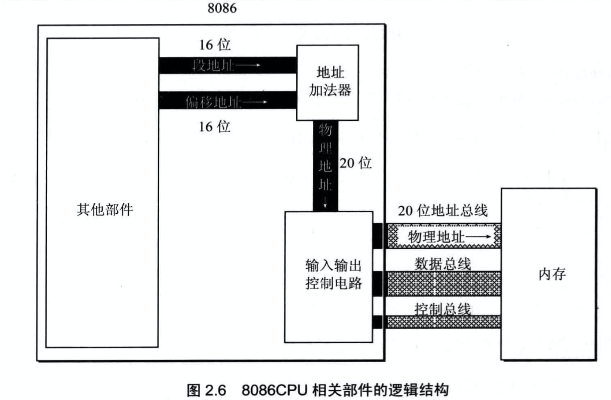
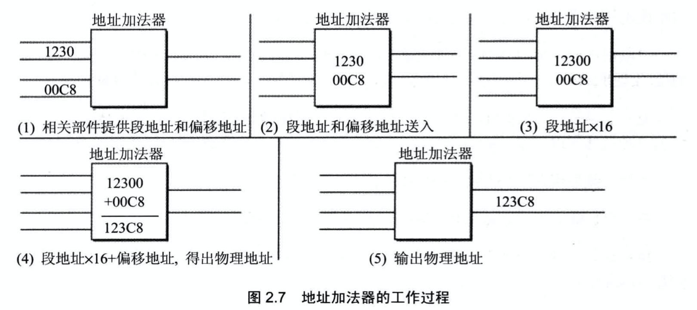
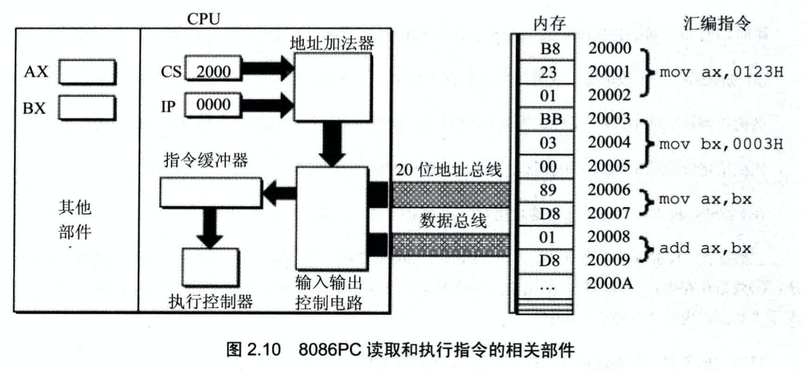
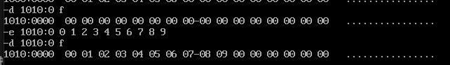
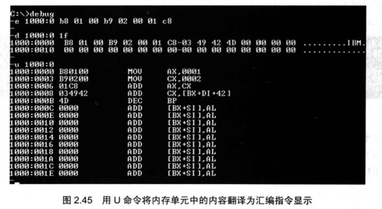
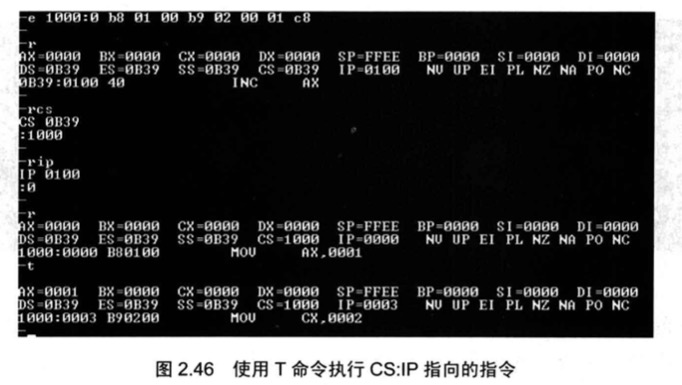
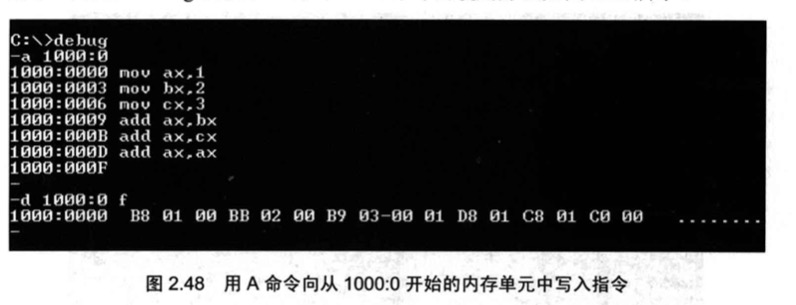

# 寄存器
一个典型的cpu由运算器, 控制器, 寄存器等器件构成. 这些器件靠内部总线相连
1. 运算器: 进行信息处理
2. 寄存器: 进行信息存储
3. 控制器: 控制各种器件进行工作
4. 内部总线连接各种器件, 在它们之间进行数据的传送

不同的cpu, 寄存器的个数和名称都不相同. 8086CPU有14个寄存器

## 通用寄存器
8086CPU的所有寄存器都是16位的, 可以存放2个字节. AX, BX, CX, DX这4个寄存器通常用来存放一般性的数据, 被称为通用寄存器

为了兼容上一代8位寄存器.AX, BX, CX, DX这4个寄存器可以分为两个独立的8位寄存器来使用
1. AX -> AH + AL  低8位构成AL, 高8位构成AH
2. BX -> BH + BL
3. CX -> CH + CL
4. DX -> DH + DL

## 16位结构CPU特性

1. 运算器一次最多可以处理16位的数据
2. 寄存器的最大宽度为16位
3. 寄存器和运算器之间的通路为16位

## 寻址能力

在8086内部,能够一次性处理, 传输, 暂时存储的信息最大长度是16位. 8086cpu有20位地址总线, 可以传送20位地址, 达到1MB的寻址能力.

8086CPU在内部用2个16位地址合成一个20位的物理地址.示意图如下:

解释:
1. cpu中相关部件提供2个16位地址, 段地址+偏移地址
2. 段地址和偏移地址通过内部总线送入一个称为地址加法器的部件
3. 地址加法器将两个16位地址合成一个20位的物理地址
4. 地址加法器通过内部总线将20位物理地址送入输入输出控制电路
5. 输入输出控制电路将20位物理地址送上地址总线
6. 20位物理地址被地址总线传送到存储器

`物理地址 = 基础地址(段地址*16) + 偏移地址`, 具体过程如下图:

cpu可以用不同的段地址和偏移地址形成同一个物理地址

| 物理地址 | 段地址 | 偏移地址 |
| --- | --- | ---: | 
| 21F60H | 2000H | 1F60H |
|   | 2100H | 0F60H |
|   | 21F0H | 0060H |
|   | 21F6H | 0000H |
|   | 1F00H | 2F60H |

给定一个段地址, 仅通过变化偏移地址来进行寻址,最多可以定位的内存单元为2^n. 如偏移地址是16位, 则变化范围是0~FFFFH, 仅用偏移地址来寻址最多64KB个内存单元.

在8086pc机中, 存储单元的地址要用2个元素(段地址, 偏移地址)来描述. 内存单元`21F60H`表示为`2000:1F60`

## 段寄存器

8086cpu有4个段寄存器: CS, DS, SS, ES

1. CS和IP是8086CPU中两个`最关键`的寄存器, 它们指示了CPU当前要读取的指令地址. CS是段寄存器, IP为指令指针寄存器
2. 任意时刻,CPU将`CS:IP`指向的内容当做指令执行

修改 `CP`和`IP`寄存器的内容
1. 同时修改`CP`和`IP`: 使用`jmp 段地址: 偏移地址`
2. 只修改`IP`: `jmp 某一合法寄存器`, 用寄存器中的值修改`IP`
    - `jmp ax`, 执行命令前: ax=1000H,CS=2000H,IP=3000H
    - `jmp ax`, 执行命令后: ax=1000H,CS=2000H,IP=1000H

## Debug 命令

Debug是DOS,Windows都提供的实时模式(8086方式)程序的调试工具.使用它,可以查看CPU各种寄存器中的内容,内存的情况和在机器码级跟踪程序的运行.

常用功能:
1. -r: 查看, 改变cpu寄存器的内容
2. -d: 查看内存中的内容
    - `d 段地址:偏移地址`可以查看从指定内存单元开始的128个内存单元的内容
    - 连续使用`d`命令, 可以列出后续内容
    - `d 段地址:起始偏移地址 结尾偏移地址`可以查看范围
3. -e: 改写内存中的内容
    - `e 起始地址 数据 数据 数据 ......`可以改写内存中的内容, 其中`起始地址=段地址:偏移地址`

    

4. -u: 将内存中的机器指令翻译成汇编指令

    

5. -t: 执行一条机器指令

    

6. -a: 以汇编指令的格式在内存中写入一条机器指令

    