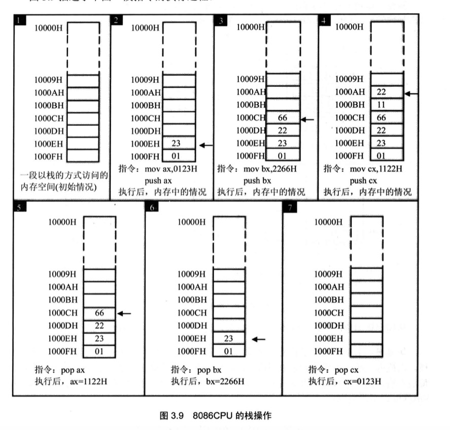
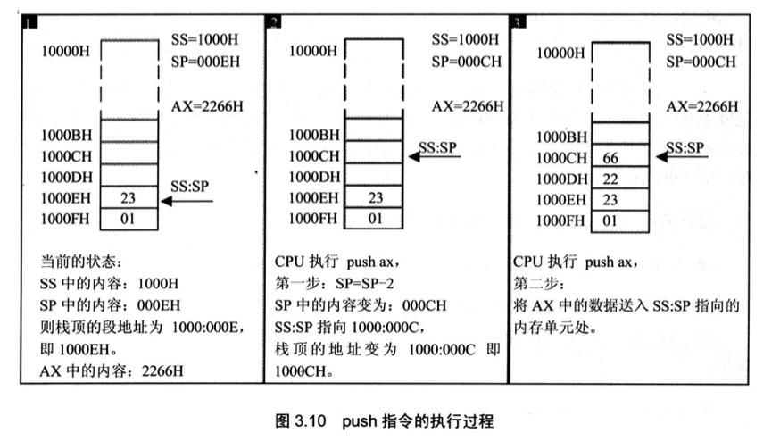
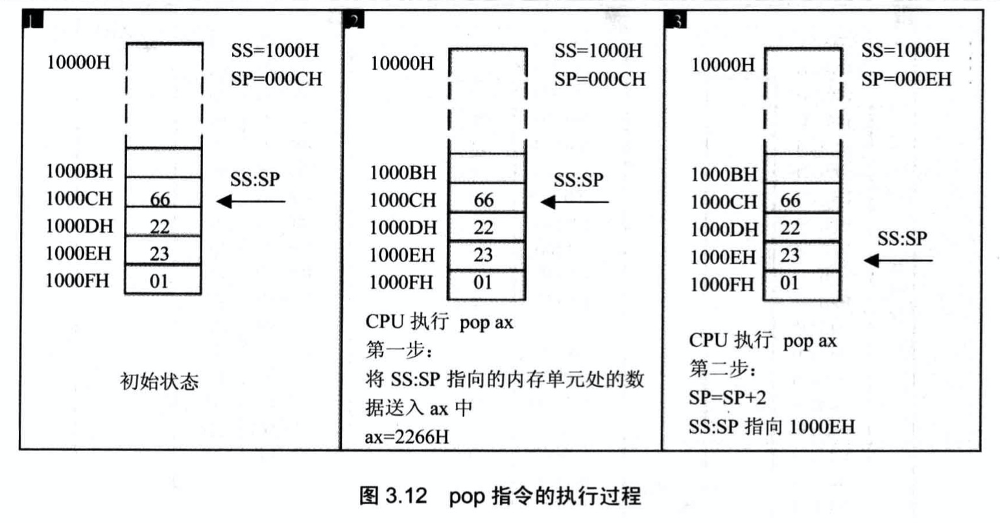
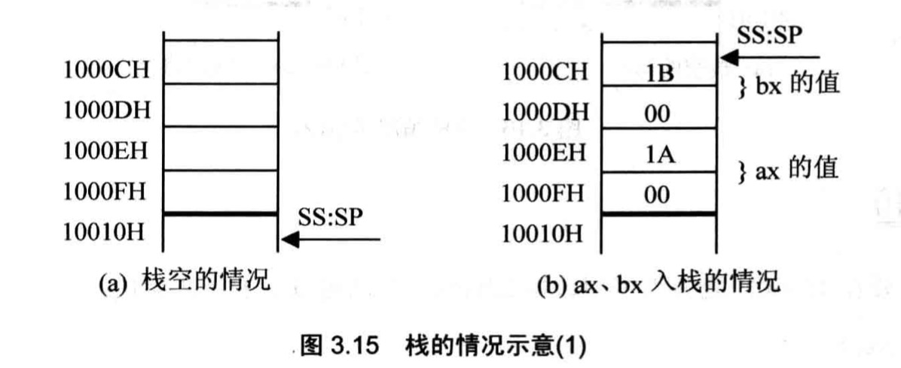

# 寄存器(内存访问)
从内存访问的角度了解寄存器

## 内存中字的存储
cpu中用16位寄存器来存储一个字. 高8位存放高位字节, 低8位存放低位字节. 由于内存单元是字节单元,一个字需要2个连续的内存单元来存放.

任何2个地址连续的内存单元,N和N+1号单元,可以将它们看成两个内存单元,也可以看成是一个地址为N的字单元中的高位字节单元和低位字节单元

## DS和[address]
8086CPU中有一个DS寄存器,通常用来存放要访问数据的段地址. 

比如要读取10000H中的内容

```asm
mov bx,1000H
mov ds,bx
mov al,[0]
```

mov,add,sub指令形式:

| 指令形式 | 例子 |
| :---- | :---- |
|mov 寄存器,数据| mov ax,8|
|mov 寄存器,寄存器| mov bx,ax|
|mov 寄存器,内存单元| mov ax,[0]|
|mov 内存单元,寄存器| mov [0],ax|
|mov 内存单元,段寄存器| mov [0],ds|
|mov 段寄存器,内存单元| mov ds,[0]|
|mov 段寄存器,寄存器| mov ds,ax|
|mov 寄存器,段寄存器| mov ax,ds|
|add 寄存器,数据| add ax,8|
|add 寄存器,寄存器| add bx,ax|
|add 寄存器,内存单元| add ax,[0]|
|add 内存单元,寄存器| add [0],ax|
|sub 寄存器,数据| sub ax,8|
|sub 寄存器,寄存器| sub bx,ax|
|sub 寄存器,内存单元| sub ax,[0]|
|sub 内存单元,寄存器| sub [0],ax|

`[...]`表示一个内存单元,`[...]`中的0表示内存单元的偏移地址

## 数据段

1. 定义数据段: 在编程时,可以根据需要,将一组内存单元(起始地址必须为16的倍数, 长度为N<=64KB)定义为一个段
2. 访问数据段: mov,add,sub,jmp等指令

如将`123B0H~123B9H`的内存单元定义为数据段(起始地址`123BH`, 长度为`10`个字节),现在需要累加该数据段前3个单元中的数据

```asm

mov ax,123B
mov ds,ax
mov al,0
add al,[0]
add al,[1]
add al,[2]

```
## cpu提供的栈机制
8086CPU可以将一段内存当做栈来使用. 8086CPU中入栈和出栈的操作都是以字为单位
1. push 入栈: 如 `push ax`表示将寄存器ax的值送入栈中
2. pop 出栈:如 `push ax`表示从栈顶取出数据送入ax

有如下指令

```asm
mov ax,0123H
push ax
mov bx,2266H
push bx
mov cx,1122H
push cx
pop ax
pop bx
pop cx
```
下图描述其执行过程



注意:
字型数据用2个单元存放, 高地址单元存放高8位, 低地址单元存放低8位

### 相关寄存器

任意时刻, `SS:SP`指向栈顶元素

`push ax`执行分为2步(入栈时,栈顶从高地址向低地址方向增长)

1. `SP=SP-2`,`SS:SP`指向当前栈顶前面的单元,以当前栈顶前面的单元为新的栈顶
2. 将ax中的内容送入`SS:SP`指向的内存单元处,`SS:SP`此时指向新栈顶



`pop ax`的执行过程和`push ax`相反

1. 将`SS:SP`指向内存单元处的数据送入`ax`中
2. `SP=SP+2`,`SS:SP`指向当前栈顶下面的单元,以当前栈顶下面的单元为新的栈顶



出栈后, `SS:SP`指向新的栈顶`1000EH`, 之前的栈顶`1000CH`处的数据`2266H`依然存在, 只是不再栈中. 当再次执行`push`等入栈指令后, `SS:SP`移至`1000CH`, 并在里面写入新的数据将其覆盖

## 栈空间超界问题


8086CPU不保证对栈的操作不会超界. 8086CPU只知道栈顶在何处(由SS:SP指示),而不知道我们安排的栈空间有多大.

## push,pop指令
push, pop等栈操作指令, 修改的只是`SP`. 栈顶的变化范围最大为`0~FFFFH`

8086CPU的栈操作机制: 

1. 提供`SS`,`SP`指示栈顶
2. 改变`SP`后写内存的入栈指令
3. 读内存后改变`SP`的出栈指令

形式:
| 指令 | 解释 |
| ---- | ---- |
| push 寄存器 | 将一个寄存器中的数据入栈 |
| pop 寄存器 | 出栈, 用一个寄存器接收出栈的数据 |
| push 段寄存器 | 将一个`段寄存器`中的数据入栈 |
| pop 段寄存器 | 出栈, 用一个`段寄存器`接收出栈的数据 |
| push 内存单元 | 将一个内存`字单元`处的字入栈(注: 栈操作都是以字为单位) |
| pop 内存单元 | 出栈, 用一个`内存单元`接收出栈的数据 |

```asm
mov ax,1000H
mov ds,ax       ;内存单元的段地址要放在ds中
push [0]        ;将1000:0处的字压入栈中
pop [2]         ;出栈, 出栈的数据送入1000:2处
```

编程:
1. 将`10000H~1000FH`这段空间当做栈,初始状态栈是空的
2. 设置`AX=001AH, BX=001BH`
3. 将AX,BX中的数据入栈
4. 然后将AX,BX清零
5. 从栈中回复AX,BX原来的内容

```asm
mov ax,1000H
mov ss,ax
mov sp,0010H    ;初始化栈顶
mov ax,001AH
mov bx,001BH

push ax
push bx         ;ax,bx入栈

sub ax,ax       ;将ax清零, 也可以使用mov ax,0
                ;sub ax,ax的机器码为2个字节
                ;mov ax,0的机器码为3个字节
sub bx,bx

pop bx          ;从栈中回复ax,bx原来的数据,当前栈顶的内容是bx
pop ax          ;ax中原来的内容001AH在栈顶的下面, 所以要先pop bx,再pop ax

```




## 栈段

#### 段
我们可以将一段内存定义为一个段, 用一个段地址指示段, 用偏移地址访问段内的单元.这完全是我们自己的安排
1. 数据段
    - 用一个段存放数据(ds寄存器)
    - 用`mov,add,sub`等访问内存单元的指令时,cpu就将数据段中的内容当做数据来访问
2. 代码段: 
    - 用一个段存放代码(cs寄存器)
    - 将断种第一条指令的偏移地址放在ip寄存器中,cpu就将执行代码段中的指令
3. 栈段: 
    - 用一个段当做栈(ss寄存器)
    - 将栈顶单元的偏移地址放到sp寄存器中,cpu在执行`push,pop`指令时将栈段当做栈空间来用

一段内存,可以既是代码的存储空间,又是数据的存储空间,还可以是栈空间,也可以都不是. 关键在于cpu中寄存器的设置,即`cs,ip,ss,sp,ds`的指向