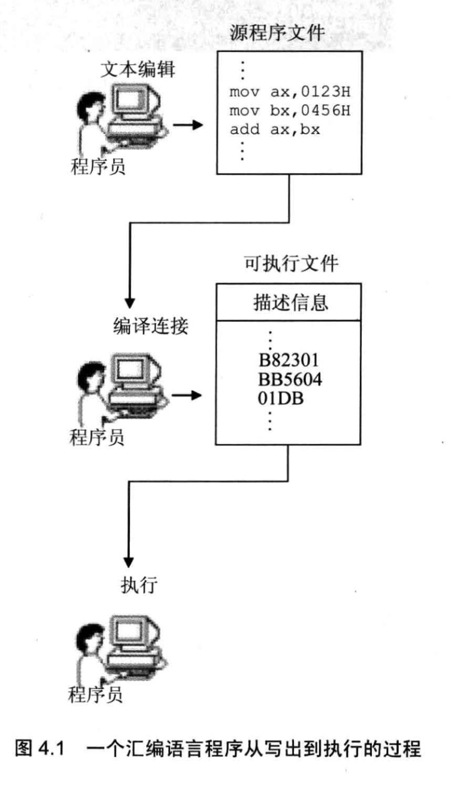
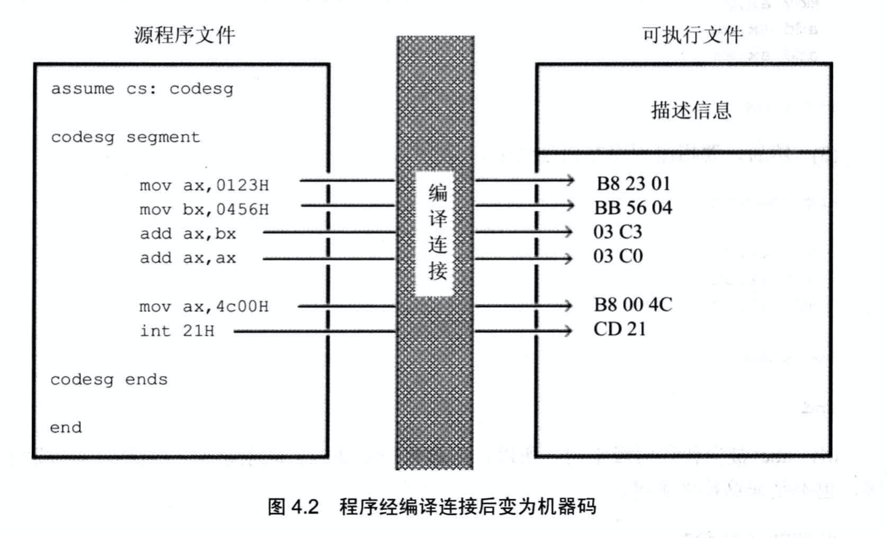
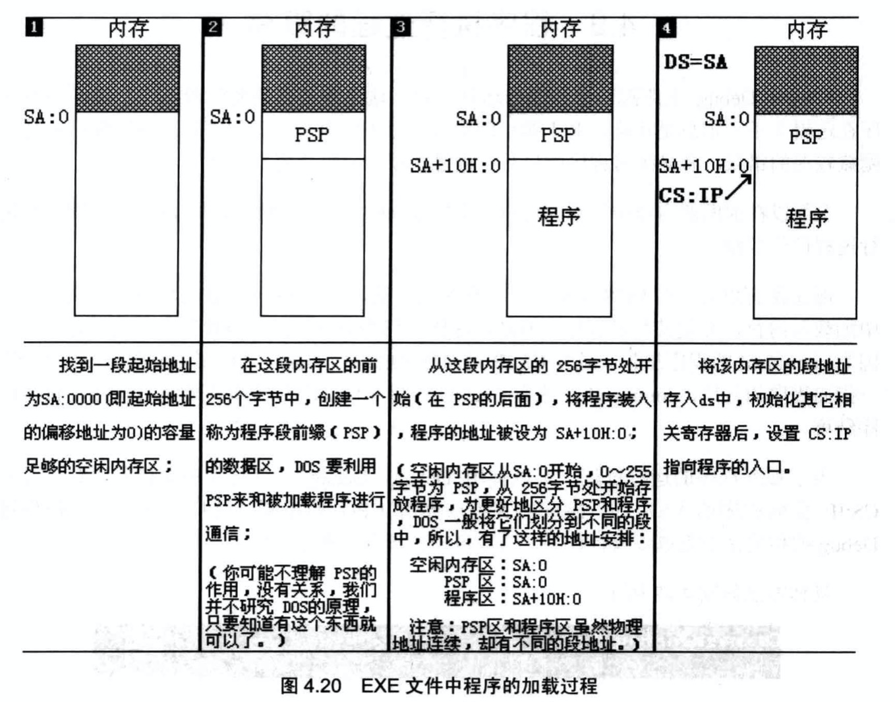

# 第一个程序

## 从编写到执行

一个汇编程序从写出到最终执行的简要过程:

1. 编写汇编源程序
    - 使用文本编辑器, 产生一个存储源程序的文本文件

2. 对源程序进行编译连接
    - 使用汇编语言编译程序对文件中的源程序进行编译, 产生目标文件
    - 使用连接程序对目标文件进行连接, 生成可在操作系统中直接运行的可执行文件(包括2部分内容)
        - 程序(从源程序中的汇编指令翻译过来的机器码)和数据(源程序中定义的数据)
        - 相关的描述信息(如: 程序有多大, 占用多少内存空间等)

3. 执行可执行文件中的程序




## 源程序

```asm
assume cs:codesg

codesg segment          ; 定义一个段, 段名称为"codesg",这个段从此开始
    mov ax,0123h
    mov bx,0456h
    add ax,bx
    add ax,ax

    mov ax,4c00h
    int 21h

codesg ends             ; 名称为"codesg"的段到此结束

end
```

1. 汇编指令: 有对应的机器码的指令, 可以被编译为机器指令,最终为CPU指向

2. 伪指令: 没有对应的机器指令, 最终不被CPU执行, 伪指令是有编译器来执行的指令, 编译器根据伪指令来进行相关的编译工作.

### 伪指令

1. 段
`xxx segment`和`xxx ends`是一对成对使用的伪指令(也是必须用到的伪指令)

一个源程序是由多个段组成,这些段是用来存放代码,数据,或当做栈空间来使用.
一个源程序中,指令,数据,栈被划分到不同的段中, 并且至少有一个段, 用来存放代码

2. `end`, end是汇编程序结束标记
3. `assume`, 某一个段寄存器和`xxx segment...ends`定义的段相关联

### 源程序中的"程序"
1. 源程序: 源程序文件中的所有内容
2. 程序: 源程序中最终由计算机执行,处理的数据.程序最先以汇编指令的形式存在于源程序中,经编译,连接后转变为机器码,存储在可执行文件中



### 标号
源程序中除了指令和伪指令外,还有一些标号,如`codesg`.一个标号指代一个地址. 如`codesg segment`此时`codesg`在段的前面,作为一个段的名称,这个段的名称最终会被编译,连接程序处理为一个段的段地址

### 程序的结构
源程序是由一些段构成的. 可以在这些段中存放代码,数据,或将某个段当做栈空间.

1. 定义一个段,名称为abc
```s
abc segment

abc ends
```
2. 在段中写入汇编指令
```s
abc segment

        mov ax,2
        add ax,ax
        add ax,ax

abc ends
```
3. 指出程序在何处结束
```s
abc segment

        mov ax,2
        add ax,ax
        add ax,ax

abc ends

end
```

4. abc被当做代码段来用,所以应该将abc和cs联系起来

```s
assume cs:abc

abc segment

        mov ax,2
        add ax,ax
        add ax,ax

abc ends

end

```
### 程序返回

一个程序P2在可执行文件中, 则必须有一个正在运行的程序P1, 将P2从可执行文件中加载入内存后,将CPU的控制权交给P2, P2才能得以运行.
P2开始运行后,P1暂停运行.

程序返回: 当P2运行完毕后,应该将CPU控制权交还给P1,让P1继续运行.

程序返回对应的汇编指令:
```s
mov ax,4c00h
int 21h
```

### 语法错误和逻辑错误
1. 语法错误: 一般来说, 程序在编译时被编译器发现的错误是语法错误
2. 逻辑错误: 在源程序编译后, 在运行时发生的错误是逻辑错误

## 编译

在编译一个源程序之前首先要有一个相应的编译器. 这里使用的是微软`masm5.0`汇编编译器.编译之后将得到目标文件(.obj)

## 连接

得到目标文件之后, 需要对目标文件进行连接, 最后得到可执行文件(.exe). 这里使用的是`Overlay Linker3.6.0`连接器.

连接的主要作用(生成可执行文件):
1. 当源程序很大时,将其分为多个文件来编译,每个源程序编译成目标文件之后, 在用连接程序将他们连接到一起,生成一个可执行文件
2. 程序中调用了某个库文件中的子程序,需要将这个库文件和该程序生成的目标文件连接到一起,生成一个可执行文件
3. 一个源程序编译后,得到了目标文件,目标文件中的有些内容还不能直接用来生成可执行文件,连接程序将这些内容处理为最终的可执行信息.

在只有一个源程序文件,且不需要调用某个库的子程序的情况下,也必须用连接程序对目标文件进行处理,生成可执行文件

## 简化方式进行编译连接
编译连接的最终目的是用源程序文件生成可执行文件, 在这个过程中所产生的中间文件都可以忽略.

编译:
- 在masm后面加上被编译的源程序文件路径,结尾需要加上分号. 
```shell
# 编译器对c:\1.asm进行编译, 在当前路径下生成模板文件1.obj, 自动忽略中间文件的生成
masm c:\1;
```
连接:
- 在link后面加上被连接的目标文件的路径,结尾需要加上分号
```shell
# 连接程序对当前路径下的1.ob进行处理, 在当前路径下生成可执行文件1.exe, 自动忽略中间文件的生成
link 1;
```

## 可执行文件的装载与运行

### 操作系统的外壳
1. shell

操作系统是由多个功能模块组成的庞大,复杂的软件系统.任何通用的操作系统,都需要提供一个称为shell(外壳)的程序,用户使用这个程序来操作计算机系统进行工作.

2. command

DOS中有一个程序`command.com`,这个程序在DOS中称为命令解释器,是DOS系统的shell.

### 程序1.exe是如何载入并运行的

1. 在DOS中直接执行1.exe时, 是正在运行的command,将1.exe中的程序加载入内存
2. command设置CPU的CS:IP指向程序的第一条指令(即程序的入口),从而使程序得以运行
3. 程序运行结束后,返回到command中,CPU继续运行command

## 程序执行过程的跟踪

exe文件中程序的加载过程:



1. 程序加载后, ds中存放着程序所在内存区的段地址, 这个内存区的偏移地址为0, 则程序所在的内存区的地址为ds:0
2. 这个内存区的前256个字节中存放的是PSP, DOS用来和程序进行通信. 从256字节处向后端空间存放的是程序