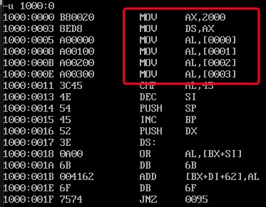
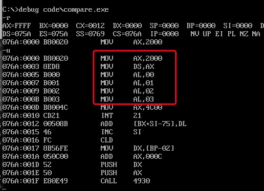
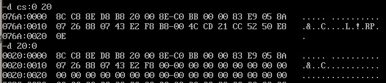

# [bx]和loop指令

1. [bx]和内存单元的描述

要完整的描述一个内存单元,需要2种信息:

- 内存单元的地址
- 内存单元的长度(类型), 由具体指令中的其他操作对象(如寄存器)指出

```s
mov ax,[0]      ; 将一个内存单元(偏移地址是0, 段地址在ds中)的内容送入ax, 由于操作对象是ax寄存器, 所以一次性会操作2个字节
mov al,[0]      ; 将一个内存单元(偏移地址是0, 段地址在ds中)的内容送入ax, 由于操作对象是al寄存器, 所以一次性会操作1个字节

mov ax,[bx]     ; 将一个内存单元(偏移地址存在bx中, 段地址在ds中)的内容送入ax, 由于操作对象是ax寄存器, 所以一次性会操作2个字节
mov al,[bx]     ; 将一个内存单元(偏移地址存在bx中, 段地址在ds中)的内容送入al, 由于操作对象是al寄存器, 所以一次性会操作1个字节
```

2. loop
3. 描述符号`()`
约定一个描述性符号"()"表示寄存器或一个内存单元中的内容


`( )`中的元素有3种类型
- 寄存器名
- 段寄存器名
- 内存单元的物理地址(一个20位数据)

如:
- (ax)表示ax中的内容
- (al)表示al中的内容
- (20000H)表示内存20000H单元的内容
- ((ds)*16+(bx)): ds中的内容为adr1, bx中的内容为adr2, 内存`adr1*16 + adr2`单元的内容. 也可以理解为段地址和偏移地址, 内存`adr1:adr2`单元的内容

4. 描述符号`idata`
约定`idata`表示常量

如:
mov ax,[idata]代表 mov ax,[1]; mov ax,[2]; mov ax,[3]等
mov bx,idata 代表 mov bx,1; mov bx,2; mov bx,3等

## Loop指令
loop指令格式: loop 标号
cpu执行loop指令分为2步:
- (cx)=(cx)-1
- 判断cx中的值,不为0则转至标号处执行程序,如果为0则向下执行

用汇编指令实现`2^12`

```s
assume cs:code

code segment

     mov ax,2
     mov cx,11
s:   add ax,ax        ;标号s,标识了一个地址,这个地址有一条指令: add ax,ax
     loop s           ;CPU执行`loop s`的时候有2步: 1. (cx)=(cx)-1, 2.判断(cx)是否为0,如果为0则执行`mov ax,4c00h`,如果不为0转至标号s所标识的地址处执行(add ax,ax)
      
     mov ax,4c00h
     int 21h

code ends

end
```

cx和loop指令配合实现循环功能有3个要点:
1. 在cx中存放循环次数
2. loop指令中的标号所标识地址要在前面
3. 要循环执行的程序段,要写在标号和loop指令的中间

```asm
mov cx,循环次数

s:
    循环执行的程序段
    loop s
```


## 在Debug中跟踪loop指令实现的循环程序

如: 计算ffff:0006单元中的数乘以3, 结果存在dx中

```s
assume cs: code

code segment

mov ax,0ffffh     ;在汇编源程序中,数据不能以字母开头,所以要在前面加0
mov ds,ax
mov bx,6          ;以上,设置ds:bx指向ffff:6

mov al,[bx]       
mov ah,0          ;以上,设置(al)=((ds*16) + (bx)), (ah)=0

mov dx,0          ;累加寄存器清0
mov cx,3          ;循环3次

s: add dx,ax
   loop s         ;以上,累加计算(ax)*3

mov ax,4c00h
int 21h           ;程序返回

code ends

end

```
在DOS中, 编译连接此源程序. 通过debug对程序进行跟踪

## Debug和汇编编译器masm对指令的不同处理
在debug中`mov ax,[0]`表示将ds:0处的数据送入ax中. 在汇编源程序中`mov ax,[0]`变编译器当做指令`mov ax,0`处理

如有任务: 将内存`2000:0, 2000:1, 2000:2, 2000:3`单元中的数据送入`al,bl,cl,dl`中

1. debug

```s
mov ax,2000
mov ds,ax
mov al,[0]
mov al,[1]
mov al,[2]
mov al,[3]
```



2. 汇编源程序

```s
assume cs:code

code segment

    mov ax,2000h
    mov ds,ax
    mov al,[0]
    mov al,[1]
    mov al,[2]
    mov al,[3]

    mov ax,4c00h
    int 21h
code ends
end
```
编译连接后, 通过debug加载exe文件.



可以发现debug和源程序对`mov al,[idata]`的解释不一样. 

debug将其解释为`[idata]`是一个内存单元,`idata`是内存单元的偏移地址. 编译器将`[idata]`解释为`idata`


在源程序中实现将内存单元的数据送入寄存器有2种方式

1. 将偏移地址送入bx寄存器中,用[bx]的方式来访问内存单元

```s
mov ax,2000h
mov ds,ax       ;
mov bx,0
mov al,[bx]
```

2. 在`[]`的前面显示给出段地址所在的段寄存器

```s
mov ax,2000h
mov ds,ax
mov al,ds:[0]
```
| 指令 | 含义 |
| ---- | ---- |
| mov al,[0] | (al)=0, 将常量0送入al中, 与`mov al,0`含义相同 |
| mov al,ds:[0] | (al)=((ds*16)+0), 将内存单元中的数据送入al中 |
| mov al,[bx] | (al)=((ds*16)+(bx)), 将内存单元中的数据送入al中 |
| mov al,ds:[bx] | 与`mov al,[bx]`相同 |

## loop和[bx]的联合应用
计算`ffff:0~ffff:b`单元中的数据的和, 结果存储在dx中

分析:
1. 计算的是数据和, 每一个内存单元是一个字节(8位), 但是寄存器是16位的.所以每次需要将8位内存单元放入到16位的寄存器中(协调好高8位和低8位)

```s

assume cs:code

code segment

    mov ax,0ffffh
    mov ds,ax
    mov bx,0        ;初始化偏移量, 保证ds:[bx]指向ffff:0

    mov dx,0        ;初始化累加寄存器
    
    mov cx,0ch      ;设置(cx)=c, 代表循环次数为c, 
                    ;计算的是0~b, 两端都是闭区间, 总共的次数为b+1次

s:  mov ah,0
    mov al,[bx]     ;将内存单元的值送到al寄存器中 (al)=((ds)*16 + (bx))
    add dx,ax       ;两个16位寄存器的值相加 (dx)=(dx)+((ds)*16 + (bx))
    inc bx          ;bx自增1, ds:bx指向下一个内存单元

    loop s

    mov ax,4c00h    ;返回
    int 21h
code ends

end
```

## 段前缀

段前缀: 出现在访问内存单元的指令中, 用于显式地指明内存单元的段地址(如: `ds:`, `cs:`, `ss:`, `es:`)
如: `mov ax,ds:[bx]`,`mov ax,cs:[bx]`,`mov ax,ss:[0]`

## 一段安全的空间
在8086模式中, 随意向一段内存空间写入内容是很危险的, 因为这段空间中可能存放着重要的系统数据或代码

在dos方式下, 一般情况, 0:200~0:2ff空间中没有系统或其他程序的数据或代码

以后如有需要直接向一段内存中写入内容时, 就使用`0:200~0:2ff`这段空间

## 段前缀使用

任务: 将内存`ffff:0~ffff:b`单元中的数据复制到`0:200~0:20b`单元中

分析:
1. `0:200~0:20b`等同于`0020:0~0020:b`,它们描述的是同一段内存空间
2. 复制过程需要循环`c=(b+1)`次,即12次
    - `ffff:0~ffff:b`和`0020:0~0020:b`的偏移地址可以设置为同一个
    - 读取`ffff:0~ffff:b`中的数据送入8位寄存器中,假设是al
    - 将al中的数据送入到`0020:0~0020:b`中

```s
assume cs:code

code segment

mov ax,0ffffh
mov ds,ax           ;ds指向被复制的段
mov ax,0020h
mov es,ax           ;es指向目标段
mov cx,0ch          ;设置循环次数
mov bx,0            ;设置公共偏移量


s: mov al,ds:[bx]   ;(al) = ((ds*16)+(bx))
   mov es:[bx],al    ;((es*16)+(bx))=(al) 理解为用al寄存器进行中转
   inc bx
   
   loop s


mov ax,4c00h
int 21h
code ends

end
```

## 实验

1. 编程,向内存`0:200~0:23f`依次传送数据`0~63(3fh)`

```s
assume cs:code

code segment

mov ax,020h
mov ds,ax       ;设置段地址为020h
mov bx,0        ;设置偏移地址0
mov cx,3fh      ;设置循环次数

s: mov [bx],bx  ;将bx中的数据传送到ds:[bx]内存中
   inc bx

   loop s

mov ax,4c00h
int 21h
code ends

end
```

2. 下面的程序功能是将`mov ax,4c00h`之前的的指令复制到内存`0:200`处,补全程序并上机调试.

分析:

- 重点是要找到指令开始的内存地址, 以及整个指令在内存中的长度
- 将起始地址送到ds, 长度送到cx
- 用loop命令改变bx的值, 并将ds:[bx]送入到目标内存单元中

- 载入程序之后, 当前程序的起始地址就是cs:ip, 在还未执行之前(ip)=0
- 载入程序之后, 当前程序的长度是存在cx寄存器中, 只要在cx寄存器改变之前, 将`mov ax,4c00h`之前的长度计算出来, 送入到别的寄存器中

```s
assume cs:code

code segment
        mov ax,cs
        mov ds,ax           ;起始段地址送入到ds中, 段寄存器cs不能直接送入ds, 需要通用寄存器中转
        mov ax,020h
        mov es,ax           ;目标段地址送入到es中
        mov bx,0            ;设置偏移地址为0
        sub cx,5            ;`mov ax,4c00h  int 21h`的长度为5, 所以(cx)-5就是需要复制的内容的长度

    s:  mov al,ds:[bx]
        mov es:[bx],al      ;把当前内存ds:[bx]中的值送到目标地址es:[bx]中  ((es*16)+(bx))=((ds*16)+(bx))
        inc bx              ;自增bx
        loop s

    mov ax,4c00h
    int 21h
code ends

end
```
执行完成之后, 可以实现`0020:0~0020:17`和`cs:0~cs:17`中的数据一致

