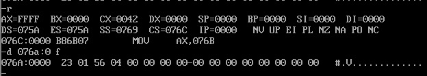

# 包含多个段的程序

在操作系统环境中, 合法地通过操作系统取得的空间都是安全的, 操作系统会保证A程序所用的空间不会与B程序的空间以及系统自己的空间冲突.在操作系统允许的情况下,程序可以取得任意容量的空间

程序取得所需空间的方法有2种:
1. 在加载程序的时候为程序分配(需要在源程序中做出说明)
2. 程序在执行的过程中向系统申请

## 在代码段中使用数据
考虑如下问题, 编程计算以下8个数据的和,结果存在ax寄存器中.
`0123h, 0456h, 0789h, 0abch, 0defh, 0fedh, 0cbah, 0987h`

用`dw`定义字型数据
用`end`指令指明了程序的入口在标号`start`处
```s
assume cs:code

code segment

  dw 0123h, 0456h, 0789h, 0abch, 0defh, 0fedh, 0cbah, 0987h
  
start:mov bx,0
      mov ax,0
      mov cx,8

s:    add ax,cs:[bx]
      add bx,2
      loop s

      mov ax,4c00h
      int 21h

code ends

end start
```

在[可执行文件的装载与运行](./04-第一个程序.md#可执行文件的装载与运行)中有介绍, 在单任务系统中,可执行文件中的程序执行过程. 其中的问题是, 如何设置CPU的`CS:IP`,使其指向第一条执行命令.

可执行文件由描述信息和程序组成:
  - 程序来自于源程序中的汇编指令和定义的数据
  - 描述信息则主要是编译,连接程序对源程序中`伪指令`进行处理得到的信息
`CS:IP`是由可执行文件中的描述信息指明的

上述程序用伪指令end描述了程序的结束和程序的入口.`end start`指明了程序的入口,被转化为一个入口地址,存储在可执行文件的描述信息中.

## 在代码段中使用栈

利用栈, 将程序中定义的数据逆序存放

```s

assume cs:codesg
codesg segment
  
  dw 0123h, 0456h, 0789h, 0abch, 0defh, 0fedh, 0cbah, 0987h
  dw 0, 0, 0, 0, 0, 0, 0, 0, 0, 0, 0, 0, 0, 0, 0, 0
                            ; 用dw定义16个字型数据,在程序加载后,将取得16个字的内存工具
                            ; 在后面的程序中将这段空间当做栈来使用

  start: mov ax,cs
         mov ss,ax
         mov sp,30h         ; 将设置栈顶ss:sp指向cs:30

         mov bx,0
         mov cx,8

    s0: push cs:[bx]        ;
        add bx,2
        loop s0             ;以上将代码段0~15单元总的8个字型数据依次入栈

        mov bx,0

    s1: pop cs:[bx]
        add bx,2
        loop s1             ;以上依次出栈8个字型数据到代码段0~15单元中

  mov ax,4c00h
  int 21h

codesg ends
end start                   ;指明程序的入口在start处

```

## 将数据,代码,栈放入不同的段
8086CPU下一个段的容量不能大于64KB, 所以数据,栈,代码需要的空间不能超过64kb. 可以用多个段来存放数据,代码,栈.

1. 定义一个段: 方法和定义代码段的方法一致, 对于不同的段, 要有不同的段名
2. 对段地址的引用: 使用段地址和偏移地址, 段地址可由段名代表, 偏移地址要看在段中的位置
3. "代码段","数据段","栈段"完全是程序员的安排.cpu如何处理段中的内容,是靠程序中具体的汇编指令,和汇编指令对`cs:ip,ss:sp,ds`等寄存器的设置来决定的

```s
assume cs:code,ds:data,ss:stack     ;将cs,ds,ss分别和code,data,stack段相连
data segment
  dw 0123h, 0456h, 0789h, 0abch, 0defh, 0fedh, 0cbah, 0987h
data ends

stack segment
  dw 0, 0, 0, 0, 0, 0, 0, 0, 0, 0, 0, 0, 0, 0, 0, 0
stack ends
code segment
  start: mov ax,stack
         mov ss,ax
         mov sp,20h         ; 将设置栈顶ss:sp指向stack:20

         mov ax,data        ; 将名称为"data"的段的段地址送入ax
         mov ds,ax          ; ds指向data段

         mov bx,0           ; ds:bx指向data段中的第一个单元
         mov cx,8

    s0: push cs:[bx]
        add bx,2
        loop s0             ; 以上将代码段0~15单元总的8个字型数据依次入栈

        mov bx,0

    s1: pop cs:[bx]
        add bx,2
        loop s1             ; 以上依次出栈8个字型数据到代码段0~15单元中

  mov ax,4c00h
  int 21h

code ends
end start                   ; 指明程序的入口在start处

```


## 实验:编写,调试具有多个段的程序

实验一:
```s
assume cs:code,ds:data,ss:stack

data segment
  dw 0123h, 0456h, 0789h, 0abch, 0defh, 0fedh, 0cbah, 0987h
data ends
stack segment
  dw 0, 0, 0, 0, 0, 0, 0, 0
stack ends
code segment
  start: mov ax,stack
         mov ss,ax
         mov sp,16

         mov ax,data
         mov ds,ax

         push ds:[0]
         push ds:[2]
         pop ds:[2]
         pop ds:[0]

         mov ax,4c00h
         int 21h
code ends
end start
```
1. cpu执行程序, 程序返回前, data段中的数据为 `0123h, 0456h, 0789h, 0abch, 0defh, 0fedh, 0cbah, 0987h`


2. cpu执行程序, 程序返回前, `cs=076c` `ss=076b` `ds=076a`
3. 设程序加载后, code段的段地址为X, 则data段的段地址为 `X-20H`(减去data和stack占用空间),stack段的段地址为 `X-10H`(减去stack占用空间)


实验二:

```s
assume cs:code,ds:data,ss:stack

data segment
  dw 0123h,0456h
data ends

stack segment
  dw 0,0,0,0,0,0,0,0,0,0,0,0,0,0,0,0,0,0,0,0,0,0,0,0,0,0,0,0
stack ends


code segment
  start: mov ax,stack
         mov ss,ax
         mov sp,16

         mov ax,data
         mov ds,ax

         push ds:[0]
         push ds:[2]

         pop ds:[2]
         pop ds:[0]

         mov ax,4c00h
         int 21h
code ends

end start

```
1. cpu执行程序, 程序返回前, data段中的数据



2. cpu执行程序, 程序返回前, `cs=076c` `ss=076b` `ds=076a`

3. 设程序加载后, code段的段地址为X, 则data段的段地址为 `X-20H`(减去data和stack占用空间),stack段的段地址为 `X-10H`(减去stack占用空间)

4. 对于如下定义的段:
```s
name segment
...
name ends
```
如果段中的数据占N个字节, 则程序加载后, 该段实际占有的空间

- `N<16`字节, 段空间为16字节
- `N>16`字节, 段空间为16字节的倍数(能装下n的最小值), 8086cpu段空间最大为64kb

实验三:

```s
assume cs:code,ds:data,ss:stack

code segment
  start: mov ax,stack
         mov ss,ax
         mov sp,16

         mov ax,data
         mov ds,ax
         
         push ds:[0]
         push ds:[2]
         pop  ds:[2]
         pop  ds:[0]

         mov ax,4c00h
         int 21h
code ends

data segment
  dw 0123h,0456h
data ends

stack segment
  dw 0,0
stack ends

end start
```

1. cpu执行程序, 程序返回前, data段中的数据


2. cpu执行程序, 程序返回前, `cs=076a` `ss=076e` `ds=076d`

3. 设程序加载后, code段的段地址为X, 则data段的段地址为 `X+code`(加上code占用空间),stack段的段地址为 `X+code+data`(加上code和data占用空间)


实验四:
如果将实验1,2,3中最后一条伪指令`end start`改为`end`(也就是说,不指明程序的入口), 这种情况下只有实验三克油正确执行.
因为不指明入口, 默认就是程序开始的段, 实验三中正好是code代码段, 其他几个都不是代码段


实验五:

编写code段中的代码, 将a段和b段中的数据依次相加, 将结果存到c段中.

```s
assume cs:code

a segment
  db 1,2,3,4,5,6,7,8
a ends

b segment
  db 1,2,3,4,5,6,7,8
b ends

c segment
  db 0,0,0,0,0,0,0,0
c ends

code segment
start: 
    mov ax,a
    mov ds,ax         ;将ds指向a段
    mov ax,b
    mov es,ax         ;将es指向b段
    mov ax,c
    mov ss,ax         ;将ss指向c段
    mov bx,0          ;初始指针为0

    mov cx,8          ;定义循环次数为8

s:  mov ax,ds:[bx]    
    add ax,es:[bx]    ;把ds:[bx]和es:[bx]相加, 存入到ax中
    mov ss:[bx],ax    ;把ax的数据存入到ss:[bx]中
    add bx,2
    loop s

    mov ax,4c00h
    int 21h
code ends

end start
```
程序执行前, 内存状况如下


执行完成之后, 内存如下, 可看见加法操作没有问题


