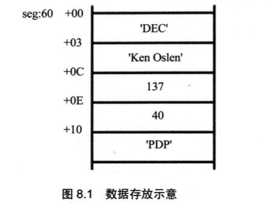

# 数据处理的两个基本问题
计算机是进行数据处理,运算的机器,有两个基本的问题包含在其中:

1. 处理的数据在什么地方?
2. 要处理的数据有多长?

这两个问题,在机器指令中必须给以明确或隐含的说明, 否则计算机就无法工作.

为了描述上的简洁,用`reg`表示一个寄存器,用`sreg`表示一个段寄存器

`reg`的集合包括:`ax, bx, cs, ds, ah, al, bh, bl, ch, cl, dh, dl, sp, bp, si, di`

`sreg`的集合包括: `ds, ss, cs, es`

## bx,si,di和bp
1. 在8086CPU中,只有这4个寄存器可以用在`[...]`中来进行内存单元的寻址

如:
```s
 mov ax,[bx]
 mov ax,[bx+si]
 mov ax,[bx+si+idata]
 mov ax,[bx+di]
 mov ax,[bx+di+idata]
 mov ax,[bp]
 mov ax,[bp+si]
 mov ax,[bp+si+idata]
 mov ax,[bp+di]
 mov ax,[bp+di+idata]
```
2. 在`[...]`中,这4个寄存器可以单个出现,或只能以4中组合出现: bx和si, bx和di, bp和si, bp和di

3. 只要在`[...]`中使用寄存器bp,而指令中没有显性给出段地址,段地址就默认在ss中
```s
mov ax,[bp]                 ;含义: (ax)=((ss)*16+(bp))
mov ax,[bp+idata]           ;含义: (ax)=((ss)*16+(bp)+idata)
mov ax,[bp+si]              ;含义: (ax)=((ss)*16+(bp)+(si))
mov ax,[bp+si+idata]        ;含义: (ax)=((ss)*16+(bp)+(si)+idata)
```
## 机器指令处理的数据在什么地方
在机器指令这一层来讲,并不关心数据的值是多少, 而关心**指令执行前一刻**, 它将要处理的数据所在的位置.

在指令执行前, 所要处理的数据可以在3个地方: CPU内部, 内存, 端口

| 机器码 | 汇编指令 | 指令执行前数据的位置 |
| ----- | ----- | ----- |
| `8E1E0000` | `mov bx,[0]` | 内存,ds:0单元 |
| `89C3` | `mov bx,ax` | CPU内部,ax寄存器 |
| `BB0100` | `mov bx,1` | CPU内部,指令缓冲器 |

## 汇编语言中数据位置的表达
汇编语言中用3个概念来表达数据的位置

1. 立即数(idata)

对于直接包含在机器指令中的数据(执行前在CPU的指令缓冲器中),在汇编语言中称为: 立即数(idata), 在汇编指令中直接给出
```s
mov ax,1
add bx,2000h
or bx 00010000b
mov al,'a'
```
2. 寄存器

指令要处理的数据在寄存器中, 在汇编指令中给出相应的寄存器名

```s
mov ax,bx
mov ds,ax
push bx
mov ds:[0],bx
push ds
mov ss,ax
mov sp,ax
```

3. 段地址(SA)和偏移地址(EA)

指令要处理的数据在内存中, 在汇编指令中可用[X]的格式给出EA,SA在某个段寄存器中.

存放段地址的寄存器可以是默认的, 也可以是显性给出

```s
mov ax,ds:[bp]        ;含义 (ax)=((ds)*16+(bp))
mov ax,es:[bx]        ;含义 (ax)=((es)*16+(bx))
mov ax,ss:[bx+si]     ;含义 (ax)=((ss)*16+(bx)+(si))
mov ax,cs:[bx+si+8]   ;含义 (ax)=((cs)*16+(bx)+(si)+8)
```


## 寻址方式
当数据存放在内存中的时候,我们可以用多种方式来给定这个内存单元的偏移地址,这种定位内存单元的方法一般被称为寻址方式

## 指令要处理的数据有多长
8086cpu的指令,可以处理两种尺寸的数据,byte和word.所以在机器指令中要指明, 指令进行的是字操作还是字节操作

1. 通过寄存器名指明要处理的数据尺寸

如,下列指令,寄存器指明了指令进行的是字操作

```s
mov ax,1
mov bx,ds:[0]
mov ds,ax
mov ds:[0],ax
inc ax
add ax,1000
```

下列指令,寄存器指明了指令信息的是字节操作

```s
mov al,1
mov al,bl
mov al,ds:[0]
mov ds:[0],al
inc al
add al,100

```
2. 在没有寄存器名存在的情况想,用操作符`X ptr`指明内存断言的长度, `X`在汇编指令中可以为`word`或`byte`

```s
;用`word ptr`指明了指令访问的内存单元是一个字单元
mov word ptr ds:[0],1
inc word ptr [bx]
inc word ptr ds:[0]
add word ptr [bx],2

;用`byte ptr`指明了指令访问的内存单元是一个字节单元

mov byte ptr ds:[0],1
inc byte ptr [bx]
inc byte ptr ds:[0]
add byte ptr [bx],2
```
在没有寄存器参与的内存单元访问指令中,用`word ptr`和`byte ptr`显性指明所要访问的内存单元的长度是很有必要的. 否则CPU无法得知索要访问的单元是字单元还是字节单元

3. 其他方法
有些指令默认了访问的是字单元还是字节单元, 比如`push [1000h]`无需指明是字单元还是字节单元, 因为push指令只进行字操作

## 寻址方式的综合应用

任务: 编程修改内存中的过时数据(更新内存数据)



用c语言来描述这个程序,大致是这样:

```c
// 定义一个公司记录的结构体
 struct company {
   char name[3];    /* 公司名称 */
   char host[9];    /* 总裁姓名 */
   int range;       /* 排名 */
   int income;      /* 收入 */
   char product[3]; /* 著名产品 */
 };

// 定义一个公司记录的变量, 内存中将存有一条公司的记录
 struct company dec = {"DEC","Ken Olsen", 137, 40, "PDP"};

 main(){
   int i;
   dec.range = 38;
   dec.income = dec.income + 70;
   i=0;
   dec.product[i] = 'V';
   i++;
   dec.product[i] = 'A';
   i++;
   dec.product[i] = 'X';
   return 0;
 }
```
按照c语言的风格, 用汇编语言写一下这个程序

```s
  mov ax,seg
  mov ds,ax
  mov bx,60h                      ;记录首地址送入BX

  mov word ptr [bx].0ch,38        ;排名字段改为38, dec.range = 38;
  add word ptr [bx].0eh,70        ;收入字段增加70, dec.income = dec.income + 70;

  mov si,0                        ; i = 0
  mov byte ptr [bx].10h[si],'V'   ; dec.product[i] = 'V';
  inc si
  mov byte ptr [bx].10h[si],'A'
  inc si
  mov byte ptr [bx].10h[si],'X'
```
一般来说,可以用`[bx+idata+si]`的方式来访问结构体中的数据. 用bx定位整个结构体,用idata定位结构体中的某一个数据项,用si定位数组项中的每个元素.如`[bx].idata, [bx].idata[si]`

## div指令

div是除法指令,用div做除法需要注意:
1. 除数: 有8位和16位两种, 在一个reg或内存单元中
2. 被除数: 默认放在ax(或dx和ax)中, 
    - 如果除数为8位, 被除数则为16位, 默认在ax中存放
    - 如果除数为16位, 被除数则为32位, 在dx和ax中存放, dx存放高16位, ax存放低16位
3. 结果:
    - 如果除数为8位, 则al存储除法操作的商, ah存储余数
    - 如果除数为16位, 则ax存储商, dx存储余数

格式如下:

```s
div reg
div 内存单元

div byte ptr ds:[0]  ;含义: (al)=(ax)/((ds)*16+0)的商, (ah)=(ax)/((ds)*16+0)的余数
div word ptr es:[0]  ;含义: (ax)=[(dx)*10000h+(ax)]/((es)*16+0)的商, (dx)=[(dx)*10000h+(ax)]/((es)*16+0)的余数

div byte ptr [bx+si+8] ;含义: (al)=(ax)/((ds)*16+(bx)+(si)+8)的商, (ah)=(ax)/((ds)*16+(bx)+(si)+8)的余数
div word ptr [bx+si+8] ;含义: (ax)=[(dx)*10000h+(ax)]/((ds)*16+(bx)+(si)+8)的商, (dx)=[(dx)*10000h+(ax)]/((ds)*16+(bx)+(si)+8)的余数
```

编程, 利用除法指令计算`100001/100`. 

分析: 

- 被除数`100001>65535`(超过16位),只能用dx和ax两个寄存器联合存放,即需要进行的是16位除法
- 由于是16位的除法,所以除数占16位,需要用一个16位寄存器来存放除数100

```s
mov dx,1
mov ax,86a1h          ;(dx)*10000h+(ax)=100001
mov bx,100
div bx
```

编程, 利用除法指令计算`1001/100`. 

分析: 
- 被除数`1001<65535`(小于16位), 除数为`100<255`, 需要进行的是8位除法
- 被除数默认放在ax中,除数需要放在8位寄存器中
```s
mov ax,1001
mov bl,100
div bl
```
## 伪指令dd
之前用db和dw分别定义字节型数据和字型数据.dd是用来定义dword(double word, 双字)型数据的.

如:
```s
data segment
  db 1          ;第一个数据为01h, 在data:0处, 占1个字节
  dw 1          ;第二个数据为0001h, 在data:1处, 占1个字(2个字节)
  dd 1          ;第三个数据为00000001h,在data:3处, 占2个字(4个字节)
data ends
```

用div计算data段中第一个数据除以第二个数据后的结果,商存在第三个数据的存储单元中.

分析: 
  1. data段中的第一个数据是被除数,为dword(双字)型,32位,在做除法之前, 需要用dx和ax存储
      - data:0字单元中的低16位存储在ax中
      - data:2字单元中的高16位存储在dx中
  2. 执行div指令(需要指明为word ptr)
```s
  data segment
    dd 100001
    dw 100
    dw 0
  data ends

  code segment
    mov ax,data
    mov ds,ax
    mov ax,ds:[0]         ;ds:0字单元中的低16位存储在ax中
    mov dx,ds:[2]         ;ds:2字单元中的高16位存储在dx中
    div word ptr ds:[4]   ;用dx:ax中的32位数据除以ds:4字单元中的数据
    mov ds:[6],ax         ;将商存储在ds:6字单元中
  code ends
```

## dup

dup是一个操作符,在汇编语言中同`db,dw,dd`一样,也是由编译器识别处理的符号.需要和`db,dw,dd`等数据定义伪指令配合使用,用来进行数据的重复.

dup的使用格式如下:

- db 重复次数 dup (重复的字节型数据)
- dw 重复次数 dup (重复的字型数据)
- dd 重复次数 dup (重复的双字型数据)

如:
```s
db 3 dup (0)   ;定义了3个字节,他们的值都是0,相当于`db 0,0,0`
db 3 dup (0,1,2);定义了9个字节,他们是`0,1,2,0,1,2,0,1,2`,相当于`db 0,1,2,0,1,2,0,1,2`
db 3 dup ('abc','ABC');定义了18个字节,他们是`abcABCabcABCabcABC`,相当于`db 'abcABCabcABCabcABC'`
```

如需要定义一个容量为200个字节的栈段
```s
stack segment
db 200 dup (0)
stack ends
```

## 实验7 寻址方式在结构化数据访问中的应用

分析:
1. 将data段视为多个数组,包括:年份(双字型), 收入(双字型), 雇员数(字型)
2. 将table段视为结构型数据的数组, 采用[bx+idata+si]的方式进行寻址
3. 单行数据分为4步进行写入, 年份(双字型), 收入(双字型), 雇员数(字型), 人均收入(字型)

为了简单, 并且方便调试, 将原题中的21年改为4年

```s
assume ds:data,cs:code
data segment
  db '1975','1976','1977','1978'
  dd 16,22,382,1356
  dw 3,7,9,12
data ends

table segment
  db 4 dup ('year summ ne ?? ')
table ends

code segment
start:mov ax,data
      mov ds,ax           ;ds指向data段
      mov ax,table
      mov ss,ax           ;ss指向table段
      mov cx,4            ;外层循环为21次

      mov bx,0            ;bx用于定位data段的行
      mov bp,0            ;bp用于定位table段的行
      mov si,0            ;si用于表示年份,收入偏移,每次增加4个字节
      mov di,0            ;di用于表示雇员数偏移,每次增加2个字节

    s:mov ax,[bx].0h[si]
      mov [bp].0h,ax
      mov ax,[bx].2h[si]
      mov [bp].2h,ax                            ;以上代码是复制年份到table段中,年份为4个字节,需要复制2次

      add bx,16                                 ;bx移到收入的起点,偏移16(4*4)字节
      mov ax,[bx].00h[si]
      mov [bp].05h,ax
      mov ax,[bx].02h[si]
      mov [bp].07h,ax                            ;以上代码是复制收入到table段中,收入为4个字节,需要复制2次
      mov ax,[bx].00h[si]
      mov dx,[bx].02h[si]                        ;将被除数(32位)放到dx(高16位)和ax(低16位)中

      add bx,16                                  ;bx移到雇员的起点,偏移16(4*4)字节
      mov es,[bx].00h[di]
      mov [bp].0ah,es                            ;以上代码是复制雇员数到table段中
      div word ptr [bp].0ah                      ;执行除法(16位除法)
      mov [bp].0dh, ax                           ;把商保存到table段中

      mov bx,0                                  ;重置bx
      add bp,16                                 ;bp移到table段的下一行,偏移16个字节
      add si,4                                  ;si用于表示年份,收入偏移,每次增加4个字节
      add di,2                                  ;di用于表示雇员数偏移,每次增加2个字节

      loop s

      mov ax,4c00h
      int 21h
    code ends

end start
```

程序载入后, 执行之前, 内存状态如下:


执行之后, 内存状态:


实验总结:
代码中的各种中转都是用的寄存器来实现, 寄存器很不够用, 可以开辟一个栈空间, 将各类中转如`ax,es`等, 存到内存当中去, 以应付更为复杂的代码