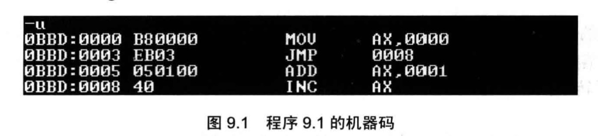
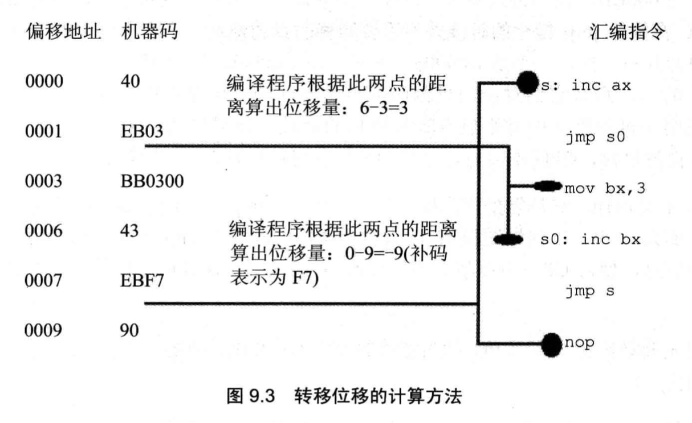
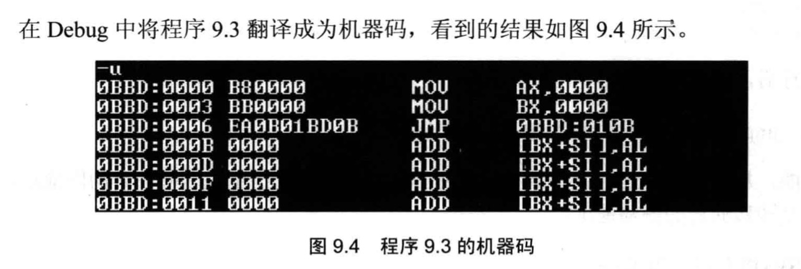
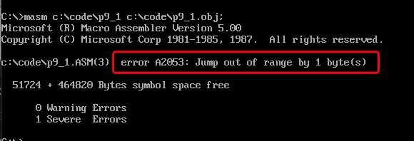
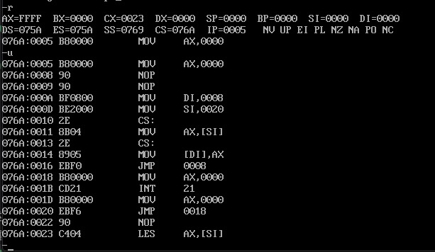
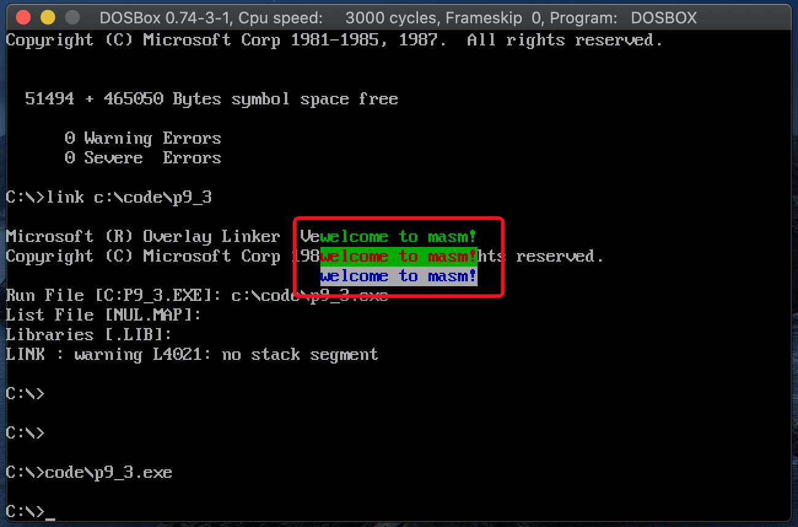

# 转移指令的原理
可以修改IP, 或同时修改CS和IP的指令统称为转移指令.

8086CPU的转移行为有以下几类
1. 只修改IP时,称为`段内转移`. 如: `jmp ax`
    - `短转移`IP的修改范围为`-128~127`
    - `近转移`IP的修改范围为`-32768~32767`
2. 同时修改CS和IP时,称为`段间转移`. 如: `jmp 1000:0`

8086CPU的转移指令分为以下几类(转移的前提条件不同,单转移的基本原理是相同的):

1. 无条件转移指令(如:jmp)
2. 条件转移指令
3. 循环指令(如:loop)
4. 过程
5. 中断

## 操作符offset
操作符`offset`在汇编语言中是由编译器处理的符号,它的功能是取得标号的偏移地址
```s
assume cs:codesg
codesg segment
  start: mov ax,offset start        ;相当于mov ax,0
      s: mov ax,offset s            ;相当于mov ax,3
codesg ends
end start
```
## jmp指令
jmp为无条件转移指令,可以只修改IP,也可以同时修改CS和IP.

jmp指令要给出两种信息:
1. 转移的目的地址
2. 转移的距离(段间转移, 段内短转移, 段内近转移)
不同的给出目的地址的方法,和不同的转移位置,对应有不同格式的jmp指令

## 依据位移进行转移的jmp指令

`jmp short 标号(转到标号处执行指令)`, 这种格式的jmp指令实现的是段内短转移, 其中`short`符号,说明指令进行的是短转移, ip修改范围是`-128~127`.

```s
assume cs:codesg
codesg segment

  start: mov ax,0
         jmp short s    ;执行`jmp short s`后越过了`add ax,1`,IP指向了标号s处的`inc ax`
         add ax,1
      s: inc ax 
codesg ends
end start
```
| 汇编指令 | 机器指令 |
| ---- | ---- |
| `mov ax,0123h` | B8 23 01 |
| `mov ax,ds:[0123h]` | A1 23 01 |
| `push ds:[0123h]` | FF 36 23 01 |

可以看到,汇编指令中的`idata`(立即数),无论它是表示一个数据还是内存单元的偏移地址,都会在对应的机器指令中出现,因为CPU执行的是机器指令,它必须要处理这些数据或地址

上述汇编程序对应的机器码为:


在`jmp short 标号`指令对应的机器码中,并不包含转移的目的地址, 而包含的是转移的位移. 这个位移是编译器根据汇编指令中的`标号`计算出来的.



`jmp short 标号`的实现是`段内短转移`,功能为: (IP)=(IP)+8位位移
1. 8位位移=标号处的地址-jmp指令后的第一个字节的地址
2. short指明此处的位移为8位位移
3. 8位位移的范围为`-128~127`,用补码表示
4. 8位位移由编译程序在编译时算出

`jmp near ptr 标号`的实现是`段内近转移`, 功能为: (IP)=(IP)+16位位移
1. 16位位移=标号处的地址-jmp指令后的第一个字节的地址在
2. near ptr指明此处的位移为16位位移,进行的是段内近转移
3. 16位位移的范围`-32768~32767`,用补码表示

## 转移的目的地址在指令中的jmp指令
`jmp far ptr 标号`,实现的是段间转移,又称为远转移. 
功能: (CS)=标号所在段的段地址; (IP)=标号所在段中的偏移地址

far ptr指明了指令用标号的段地址和偏移地址修改CS和IP
```s
assume cs:codesg

codesg segment
start: mov ax,0
       mov bx,0
       jmp far ptr s
       db 256 dup (0)
    s: add ax,1
       inc ax
codesg ends
end start
```
其机器代码为:


注意`jmp far ptr s`对应的机器码: `EA 0B 01 BD 0B`,其中包含转移的目的地址. `0B 01 BD 0B`是目的地址在指令中的存储孙旭,高地址的`BD 0B`是的转移的段地址(`0BBDH`).低地址的`0B 01`是偏移地址(`010BH`)

## 转移地址在寄存器中的jmp指令
指令格式: `jmp 16位reg`

功能: `(IP)=(16位reg)`

## 转移地址在内存中的jmp指令
有两种格式:
1. `jmp word ptr`内存单元地址(段内转移)

- 功能: 从内存单元地址处开始存放着一个字,是转移的目的偏移地址

```s
mov ax,0123h
mov ds:[0],ax
jmp word ptr ds:[0]     ;执行后(IP)=(0123h)
```
```s
mov ax,0123h
mov [bx],ax
jmp word ptr [bx]       ;执行后(IP)=(0123h)
```
2. `jmp dword ptr`内存单元地址(段间转移)
- 功能: 从内存单元地址处开始存放着`两个字(4字节)`, 高地址处是转移目的的段地址, 低地址处是转移目的的偏移地址
`(CS)=(内存单元地址+2)`, `(IP)=(内存单元地址)`

```s
mov ax,0123h
mov ds:[0],ax
mov word ptr ds:[2],0
jmp dword ptr ds:[0]      ;执行后(CS)=0,(IP)=(0123h), CS:IP指向0000:0123
```

```s
mov ax,0123h
mov [bx],ax
mov word ptr [bx+2],0
jmp dword ptr [bx]        ;执行后(CS)=0,(IP)=(0123h), CS:IP指向0000:0123
```
## jcxz指令
jcxz指令为`有条件转移指令`, 所有的有条件转移指令都是短转移, 在对应的机器码中包含转移的位移, 而不是目的地址. IP的修改范围都为`-128~127`

1. 指令格式: `jcxz 标号`(如果(cx)=0, 转移到标号处执行)
2. 操作: 当`(cx=0)`时, `(IP)=(IP)+8位位移`; 当`(cx)!=0`时,什么也不做(程序向下执行)
    - 8位位移=标号处的地址-jcxz指令后的第一个字节的地址
    - 8位位移的范围为-128~127,用补码表示
    - 8位位移由编译程序在编译时算出

`jcxz 标号`的功能相当于:

```c
if((cx)==0)jmp short 标号;
```

编程, 利用jcxz指令,实现在内存2000h段中查找第一个值为0的字节,找到后,将它的偏移地址存储在dx中


分析:
将[bx]所指向的内存单元直接送到cx中, 如果`(cx)=0`,执行有条件转移`jcxz ok`, 如果`(cx)!=0`则增加bx偏移
```s
assume cs:code
code segment
  start: mov ax,2000h
         mov ds,ax
         mov bx,0

      s: mov ch,0
         mov cl,[bx]
         jcxz ok
         add bx,1
         jmp short s

    ok: mov dx,bx
        mov ax,4c00h
        int 21h
code ends
end start
```

## loop指令

loop指令为循环指令, 所有的循环指令都是`短转移`,在对应的机器码中包含转移的位移,而不是目的地址.对IP的修改范围都为:`-128~127`

1. 指令格式: `loop 标号`((cx)=(cx)-1, 如果(cx)!=0, 转移到标号处执行)
2. 操作:
- `(cx)=(cx)-1`
- 如果`(cx)!=0`,`(IP)=(IP)+8位位移`; 如果(cx)=0, 什么也不做(程序向下执行)
    - 8位位移=标号处的地址-loop指令后的第一个字节的地址
    - 8位位移的范围是-128~127,用补码表示
    - 8位位移由编译程序在编译时算出

`loop 标号`的功能相当于:
```c
(cx)--;
if((cx)!=0)jmp short 标号;
```

编程,利用loop指令,实现在内存2000h段中查找第一个值为0的字节, 找到后将它的偏移地址存储在dx中.

```s
assume cs:code
code segment
  start: mov ax,2000h
         mov ds,ax
         mov bx,0
      s: mov cl,[bx]
         mov ch,0
         inc cx           ;因为执行loop是会先将cx-1再判断cx是否为0, 所以在此增加cx
         inc bx
         loop s
      ok:dec bx           ;dec指令的功能和inc相反,dec bx进行的操作为: (bx)=(bx)-1
         mov dx,bx
         mov ax,4c00h
         int 21h
code ends
end start
```
## 根据位移进行转移的意义
到目前为止, 学到有4种短转移
1. `jmp short 标号`
2. `jmp near ptr 标号`
3. `jcxz 标号`
4. `loop 标号`
它们对IP的修改是更加转移目的地址和转移起始地址之间的位移来进行的.对应的机器码中包含的是到目的地址的位移.

这种设计,方便了程序段在内存中的浮动装配

如:
```s
  汇编指令              机器代码
  mov cx,6             B9 06 00
  mov ax,10h           B8 10 00
 s:add ax,ax           01 C0
   loop s              E2 FC 
```
这段程序装在呢次中的不同位置都可以正确执行, 因为loop s在执行时只涉及s的位移(-4,前移4字节,补码表示`FCH`),不涉及s的地址.无论s处的实际地址低多少,loop指令的转移位移是不变的

## 编译器对转移位移超界的检测
根据位移进行转移的指令,转移的访问搜到转移位移的限制,如果在源程序中出现了转移范围超界的问题,在编译的时候,编译器将报错

如下程序,会引起编译错误:
```s
assume cs:code
code segment
  start: jmp short s
        db 128 dup (0)
      s: mov ax,0ffffh
code ends
end start
```


`jmp short s`的转移范围是`-128~127`,IP最多向后移动127个字节.

注意: 以前在debug中直接使用如`jmp 2000:0100`的转移指令, 只能在debug中才能被解析, 汇编编译器并不认识. 如果在源程序中使用,编译时会报错.

## 实验8 分析一个奇怪的程序
分析如下程序, 思考这个程序是否能正确返回?

分析: 最终会正常返回
理由: 
1. `jmp short 标号`指令对应的机器码是2个字节, 短转移指令是根据相对位移进行转移. 
2. 标号`s`处的指令在运行过程中会被修改为`jmp short s1`所对应机器码, 执行此指令会将`(IP)=(IP)-10`(补码为F6h), 正好就会执行code入口之前的代码
3. 最终会运行`mov ax,4c00h`和`int 21h`退出程序

```s
assume cs:code
code segment
      mov ax,4c00h
      int 21h
  start: mov ax,0
      s: nop
         nop
         
         mov di,offset s
         mov si,offset s2
         mov ax,cs:[si]
         mov cs:[di],ax

      s0: jmp short s

      s1: mov ax,0
          int 21h
          mov ax,0

      s2: jmp short s1
          nop
code ends
end start
```
程序执行前,寄存器情况如下:



## 实验9 根据材料编程

编程: 在屏幕中间分别显示绿色, 绿底红色, 白底蓝色的字串`welcome to masm!`

分析: 
1. 可供写入的内存范围是`B800:0000~B800:7FFF`
2. 构造一个彩色字体, 循环将`welcome to masm!`写入到屏幕中央, 共循环3次(绿色字体: `00000010B`. 绿底红字: `00100100B`. 白底蓝字: `01110001B`)
3. `welcome to masm!`是16个字节, 再加上彩色共占用32位. 屏幕中央的起始位置横坐标`(160-32)/2=64`, 总共显示3行, 所以纵坐标`(25-3)/2=11`. 所以计算出起始的偏移地址`11*160+64=720h`
4. 外层循环每执行一次, 偏移地址增加一行(160字节)
5. 外层循环确定起始偏移地址, 内层循环确定每一个字符的偏移地址


```s
assume cs:code,ds:data,ss:stack
data segment
  db 'welcome to masm!'                   ;定义需要显示的字符串
  db 00000010B,00100100B,01110001B        ;定义需要显示的彩色
data ends

stack segment
  db 0,0,0,0,0,0,0,0                      ;定义8个字节的栈空间, 用来存储寄存器的中间值, 解决寄存器不够用的问题
stack ends

code segment

  start: mov ax,data
         mov ds,ax
         
         mov ax,stack
         mov ss,ax
         mov sp,8              ;定位栈顶
     
         mov cx,3              ;最外层循环只有3次, 输出3个字符串
         mov di,0
         mov ax,0B800h
         mov es,ax         ;为了bp寄存器能正确定位,先定位到第11行, 再根据di来设置偏移
         mov bp,720h       ;第一行的偏移地址

     s0: mov bx,0
         mov si,0
         push cx
         mov cx,16             ;内层循环16次(因为字符串长度为16)
     
     s1: mov al,[bx].0h[si]    ;设置字符
         mov ah,[bx].10h[di]   ;设置颜色

         push si               ;再次将si用于定位显存输出
         add si,si             ;显存上的偏移是字符的2倍(因为颜色多占一个字节, 所以当字符原始偏移为si时, 最终写入到显示缓冲区为si+si)
         
         mov es:[bp].0h[si],ax ;将ax的数据写入到显示缓冲区
         
         mov ax,stack
         mov ss,ax             ;还原ss,重新回到栈空间
         pop si                ;还原si

         inc si
         loop s1

         inc di                ;(di)=(di)+1, 定位到下一个颜色
         add bp,0a0h           ;纵坐标增加一行(160字节) 
         pop cx                ;还原cx   
         loop s0
         
         mov ax,4c00h
         int 21h

code ends

end start
```
最终输出结果:

