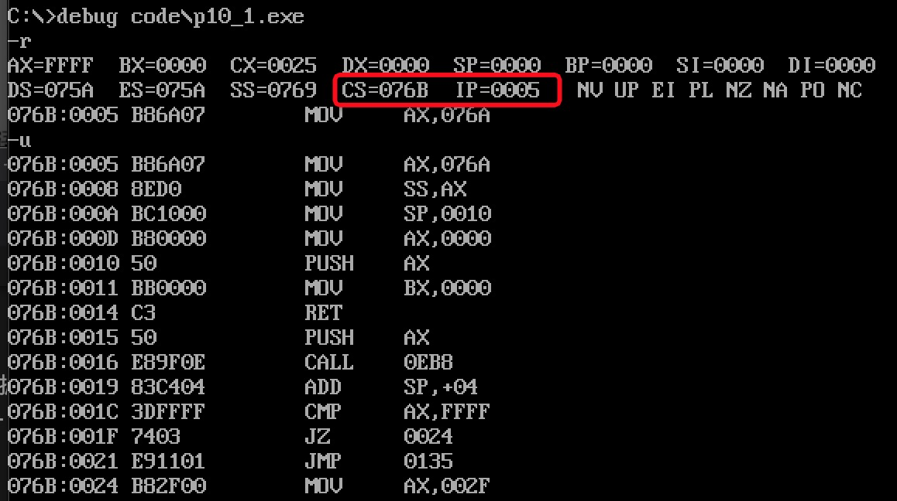
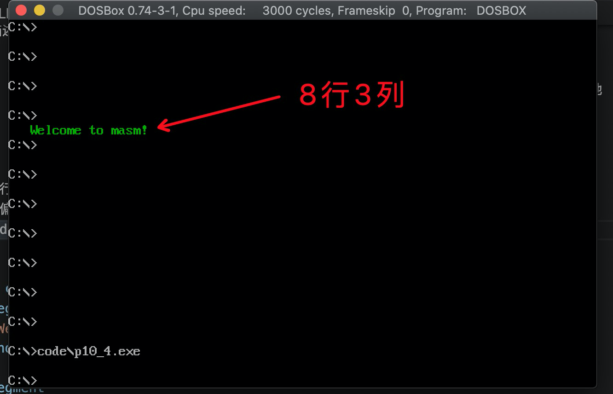

# CALL和RET指令
call和ret指令都是转移指令,他们都修改IP,或同时修改CS和IP.他们经常被共同用来实现子程序的设计.

## ret和retf
1. `ret`指令用栈中的数据,修改IP,实现`近转移`. CPU执行ret时,相当于进行`pop IP`
    - (IP)=((ss)*16+(sp))
    - (sp)=(sp)+2


2. `retf`指令用栈中的数据,修改CS和IP的内容,实现`远转移`.CPU执行`retf`时,相当于进行`pop IP`, `pop CS`
    - (IP)=((ss)*16+(sp))
    - (sp)=(sp)+2

    - (CS)=((ss)*16+(sp))
    - (sp)=(sp)+2

如下程序:

```s
assume cs:code

stack segment
  db 16 dup (0)
stack ends

code segment
       mov ax,4c00h
       int 21h
start: mov ax,stack
       mov ss,ax
       mov sp,16
       mov ax,0
       push ax
       mov bx,0
       ret
code ends

end start
```
执行前, 关注CS:IP寄存器:


`ret`指令执行后,(IP)=0,CS:IP指向代码段的第一条指令, 继续执行会退出程序


如下程序,`retf`执行后,CS:IP指向代码段的第一条指令
```s
assume cs:code

stack segment
  db 16 dup (0)
stack ends

code segment
       mov ax,4c00h
       int 21h
start: mov ax,stack
       mov ss,ax
       mov sp,16
       mov ax,0
       push cs
       push ax
       mov bx,0
       retf
code ends

end start
```

## call指令
CPU执行call指令时, 进行两步操作
1. 将当前的IP或CS和IP压入栈中
2. 转移

call指令不能实现短转移, 除此之外, call指令实现转移的方法和jmp指令的原理相同

## 依据位移进行转移的call指令
格式: `call 标号`(将当前的IP压栈后, 转到标号处执行指令).
功能:
```
1. (sp)=(sp)-2 
   ((ss)*16+(sp))=(IP)
2. (IP)=(IP)+16位位移
```
- 16位位移=标号处的地址-call指令后的第一个字节的地址
- 16位位移的范围是`-32768~32767`,用补码表示
- 16位位移由编译程序在编译时算出

汇编语法解释:
```s
push IP
jmp near ptr 标号
```
## 转移的目的地址在指令中的call指令
格式: `call far ptr 标号`实现的是段间转移.
功能:
```
1. (sp)=(sp)-2
   ((ss)*16+(sp))=(CS)
   (sp)=(sp)-2
   ((ss)*16+(sp))=(IP)

2. (CS)=标号所在段的段地址
   (IP)=标号在段中的偏移地址
```
汇编语法解释:
```s
push CS
push IP
jmp far ptr 标号
```

## 转移地址在寄存器中的call指令
格式: `call 16位reg`
功能:
```
(sp)=(sp)-2
((ss)*16+(sp))=(IP)
(IP)=(16位reg)
```
汇编语法解释:
```s
push IP
jmp 16位reg
```    
## 转移地址在内存中的call指令

格式:
1. `call word ptr 内存单元地址`
    - 汇编解释
    ```s
      push IP
      jmp word ptr 内存单元地址
    ```
      如下指令:
    ```s
      mov sp,10h
      mov ax,0123h
      mov ds:[0],ax
      call word ptr ds:[0] ; 执行后,(IP)=0123h, (sp)=0Eh
    ```
2. `call dword ptr 内存单元地址`
    - 汇编解释
    ```s
      push CS
      push IP
      jmp dword ptr 内存单元地址
    ```
    如下指令:
    ```s
      mov sp,10h
      mov ax,0123h
      mov ds:[0],ax
      mov word ptr ds:[2], 0
      call dword ptr ds:[0] ;执行后(CS)=0, (IP)=0123h, (SP)=0CH
    ```

分析以下程序执行后, ax和bx中的数值为多少.

```s
assume cs:code
data segment
  dw 8 dum (0)
data ends

code segment
  start:mov ax,data
        mov ss,ax
        mov sp,16
        mov word ptr ss:[0], offset s
        mov ss:[2],cs
        call dword ptr ss:[0]   ;将当前CS和IP压栈(`nop`的段地址和偏移地址),(ss:[0eh])=(CS),(ss:[0ch])=(IP)
        nop
      s:mov ax,offset s
        sub ax,ss:[0cH]         ;执行之后(ax)=1
        mov bx,cs
        sub bx,ss:[0eh]         ;执行之后(bx)=0
        mov ax,4c00h
        int 21h 
code ends

end start
```
## call和ret的配合使用
以下程序返回前, 分析bx中的值
```s
assume cs:code
code segment
  start: mov ax,1
         mov cx,3
         call s       ;将当前IP(`mov bx,ax`的偏移地址)压栈, 转移到标号s处执行指令
         mov bx,ax    ;返回前(bx)=8
         mov bx,4c00h
         int 21h
       s:add ax,ax
         loop s
         ret          ;从栈中弹出
code ends
end start
```
可以利用call和ret来实现子程序的机制. 子程序的框架如下
```
标号:
    指令
    ret
```
具有自程序的源程序框架如下
```s
assume cs:code
code segment
  main: :
        :
        call sub1         ;调用子程序sub1
        :
        mov ax,4c00h
        int 21h
  sub1: :                 ;子程序sub1开始
        :
        call sub2         ;调用子程序sub2
        :
        ret               ;子程序返回
  sub2: :                 ;子程序sub2开始
        :
        ret               ;子程序返回
code ends
end main
```

## mul指令
mul是乘法指令
1. 两个相乘的数: 要么都是8位,要么都是16位.
    - 如果是8位, 一个默认放在al中, 另一个放在8位reg或内存`字节单元`中
    - 如果是16位, 一个默认放在ax中, 另一个放在16位reg或内存`字单元`中
2. 结果
    - 如果是8位乘法, 结果默认放在ax中
    - 如果是16位乘法, 结果高位默认在dx中, 低位在ax中

格式:
```
mul reg
mul 内存单元
```
内存单元可以用不同的寻址方式给出, 如:
```s
mul byte ptr ds:[0]       ;含义: (ax)=(al)*((ds)*16+0)
mul word ptr [bx+si+8]    ;含义: (ax)=(ax)*((ds)*16+(bx)+(si)+8)结果的低16位
                          ;     (dx)=(ax)*((ds)*16+(bx)+(si)+8)结果的高16位
```

- 计算`100*10`: 100和10小于255, 可以做8位乘法

```s
mov al,100
mov bl,10
mul bl      ;结果(ax)=1000(03e8h)
```

- 计算`100*10000`: 100小于255,但是10000大于255, 必须做16位乘法
```s
mov ax,100
mov bx,10000
mul bx      ;结果(ax)=4240h,(dx)=000fh   (f4240h=1000000)
```

## 模块化程序设计
call和ret指令共同支持了汇编语言编程中的模块化设计.在实际编程中,程序的模块化是必不可少的. 利用call和ret指令,可以实现多个相互联系,功能独立的子程序来解决一个复杂的问题

## 参数和结果传递的问题
设计一个子程序, 可以根据提供的N, 来计算N的3次方.
可以用寄存器来存储参数和结果值.为了方便,可将结果放到dx和ax中, 子程序如下:

```s
;说明: 计算N的3次方
;参数: (bx)=N
;结果: (dx:ax)=N^3 

cube: mov ax,bx
      mul bx
      mul bx
      ret
```
用寄存器来存储参数和结果是最常用使用的方法.
- 调用者将参数送入到参数寄存器,从结果寄存器中取到返回值
- 子程序从参数寄存器中取到参数, 将返回值送入结果寄存器

编程,计算data段中第一组数据的3次方,结果保存在后面一组dword单元中

```s
assume cs:code
data segment
  dw 1,2,3,4,5,6,7,8
  dd 8 dup (0)
data ends

code segment
  start:mov ax,data
        mov ds,ax
        mov si,0              ;ds:si指向第一组word单元
        mov di,16             ;ds:di指向第二组word单元

        mov cx,8
    s:  mov bx,[si]
        call cube
        mov [di],ax
        mov [di].2,dx
        add si,2              ;ds:si指向下一个word单元
        add di,4              ;ds:di指向下一个dword单元
        loop s

        mov ax,4c00h
        int 21h

  cube: mov ax,bx
        mul bx
        mul bx
        ret
code ends

end start

```

## 批量数据的传递

将批量数据放到内存中, 然后将他们所在内存空间的首地址放在寄存器中,传递给需要的子程序

设计一个子程序, 将一个全是字母的字符串转化为大写

```s
captical: and byte ptr [si], 11011111b      ;将ds:si所指单元中的字母转化为大写
          inc si                            ;ds:si指向下一个单元
          loop captical
          ret 
```

```s
assume cs:code
data segment
  db 'conversation'
data ends

code segment
  
  start:  mov ax, data
          mov ds,ax
          mov si,0            ;ds:si指向字符串(批量数据)所在空间的首地址
          mov cx,12           ;cx存放字符串的长度
          call captical
          mov ax,4c00h
          int 21h


captical: and byte ptr [si], 11011111b      ;将ds:si所指单元中的字母转化为大写
          inc si                            ;ds:si指向下一个单元
          loop captical
          ret 

code ends

end start
```


## 附录4 用栈来传递参数


## 寄存器冲突问题

主程序和子程序之间的寄存器冲突, 需要合理使用栈空间来解决.
在子程序的开始将子程序中所有用到的寄存器中的内容都保存起来, 在子程序返回前再恢复

```
  子程序开始: 子程序中使用的寄存器入栈
            子程序内容
            子程序中使用的寄存器出栈
            返回(ret,retf)
```


设计一个子程序, 将一个全是字母, 以0结尾的字符串, 转换为大写

```s
assume cs:code

data segment
  db 'word',0
  db 'unix',0
  db 'wind',0
  db 'good',0
data ends

code segment
  start: mov ax,data
         mov ds,ax
         mov si,0
         mov bx,0
         
         mov cx,4         ;外层循环4次
      s: mov si,bx
         call capital
         add bx,5         ;字符串的长度为5(算上结尾字符0)
         loop s

         mov ax,4c00h
         int 21h
code ends

;说明: 将一个全是字母, 以0结尾的字符串, 转换为大写
;参数: ds:si指向字符串的首地址
;结果: 没有返回值
capital: push cx
         push si

transfer:mov cl,[si]
         mov ch,0
         jcxz ok
         and byte ptr [si], 11011111b     ;将ds:si所指单元中的字母转化为大写
         inc si
         jmp short transfer

     ok: pop si
         pop cx
         ret
end start
```

## 实验10 编写子程序
1. 显示字符串

子程序描述:
- 名称: show_str
- 功能: 在指定的位置,用指定的颜色,显示一个用0结束的字符串
- 参数: (dh)=行号(取值范围0~24), (dl)=列号(取值范围0~79), (cl)=颜色, ds:si指向字符串的首地址
- 返回: 无

分析: 
1. 根据行号和列号,将data段中的数据写入显示缓冲区(存范围是`B800:0000~B800:7FFF`)
2. 起始偏移地址是: B800:[(dh)*160+(dl)*2]
3. 循环data段中的字节, 并与cl颜色进行组合, 循环写入偏移地址

```s
assume cs:code
data segment
  db 'Welcome to masm!',0
data ends

code segment

   start: mov dh,8
          mov dl,3
          mov cl,2
          mov ax,data
          mov ds,ax
          mov si,0
          call show_str
          mov ax,4c00h
          int 21h
show_str: push ds
          push si
          push dx
          push cx
          push ax
          push es
          push bx

          mov ax,0b800h
          mov es,ax               ;显示缓冲区的起始地址
          mov al,160
          mul dh                  ;8位乘法, 计算行列
          mov bx,ax
          mov al,2
          mul dl
          add bx,ax               ;以上代码是存储初始偏移地址

    run:  push cx
          mov cl, [si]
          mov ch, 0
          jcxz ok
          pop cx
          mov al,[si]
          mov ah, cl               ;构造 颜色属性
          push si
          add si, si
          mov es:[bx].0h[si],ax    ;写入显示缓冲区
          pop si
          inc si
          jmp short run
      
      ok: pop cx
          pop bx
          pop es
          pop ax
          pop cx
          pop dx
          pop si
          pop ds         ;还原寄存器
          ret
code ends
end start

```
在第8行3列中输入绿色字符串:



2. 解决除法溢出问题

在用div指令做除法时,如果结果的商过大, 超出了寄存器所能存储的范围, 将引发cup的一个内部错误, 这个错误称为**除法溢出**
```s
mov bh,1
mov ax,1000
div bh
; 进行8位除法, 结果的商为1000, 而1000在al中放不下
```

子程序描述:
- 名称: divdw
- 功能: 进行不会产生溢出的除法运算, 被除数为`dword`型, 除数为`word`型, 结果为`dword`型
- 参数
    - (ax)=dword型数据的低16位
    - (dx)=dword型数据的高16位
    - (cx)=除数
- 返回
    - (dx)=结果的高16位, (ax)=结果的低16位, (cx)=余数

提示: 为了防止溢出, 可以使用一个数学公式
```
X:被除数, 范围: [0, ffffffff] 4字节
N:除数, 范围: [0, ffff] 2字节
H:X高16位, 范围: [0, ffff] 2字节
L:X低16位, 范围: [0, ffff] 2字节
int(): 描述性运算符, 取商, 比如, int(38/10)=3
rem(): 描述性运算符, 取余数, 比如, rem(38/10)=8

公式: X/N=int(H/N)*65536 + [rem(H/N)*65536 + L]/N
```
这个公式将可能产生溢出的除法运算(X/N)转变为多个不会产生溢出的除法运算. 公式中等号右边的除法都可以用div指令, 肯定不会导致除法溢出

计算`1000000/10(f4240h/0ah)`

分析: 将初始寄存器中的参数, 带入公式中进行计算, 保留在结果寄存器中

```s
assume cs:code

code segment
  start: mov ax,4240h
         mov dx,000fh
         mov cx,0ah
         call divdw
         
         mov ax,4c00h
         int 21h

divdw:push bx      ;入栈将要使用到的寄存器
      push ax      ;保存(ax)=dword型数据的低16位
      mov ax,dx    ;把高16位移到低16位的位置上
      mov dx,0     ;清空高16位
      div cx       ;计算 (ax) = int(H/N), (dx)=rem(H/N)
      
      pop bx       ;出栈, (bx)=dword型数据的低16位
      push ax      ;保存int(H/N)

      mov ax,bx    ;(ax)=dword型数据的低16位
      div cx       ;计算[rem(H/N)*65536 + L]/N. 得到结果: (ax)=最终商的低16位
      mov cx,dx    ;得到结果: (cx)=余数
      pop dx       ;出栈int(H/N), 得到结果: (dx)=最终商的高16位

      pop bx       ;还原bx
      ret          ;返回
code ends

end start
```

3. 数值显示
编程, 将data段中的数据以十进制的形式显示出来. 如将数据12666以十进制的形式在屏幕的8行3列, 用绿色显示出来.

```s
data segment
  dw 123,12666,1,8,3,38
data ends
```

分析: 
1. 由于显卡遵循的是ASCII编码, 为了在显示器上看到"12666", 那么在机器中应该以ASCII码的形式存储: `31h, 32h, 36h, 36h, 36h`
2. 将用二进制信息存储的数据转变为十进制形式的字符串
3. 调用以前实现的`show_str`可以将其显示出来


子程序描述:
- 名称: dtoc
- 功能: 将word型数据转变为表示十进制的字符串, 字符串以0位结尾符
- 参数: (ax)=word型数据, ds:si指向字符串的首地址
- 返回: 无


```s
assume cs:code
data segment
  db 10 dup (0)
data ends

code segment
  start: mov ax,12666
         mov bx,data
         mov ds,bx
         mov si,0

         call dtoc

         mov dh,8
         mov dl,3
         mov cl,2
         mov ch,0         ;保证高8位为0
         call show_str

         mov ax, 4c00h
         int 21h
;----
; dtoc 将数字转换成字符串
;-----
  dtoc:push ax
       push si
       push cx

dtoc_s: mov cx,10           ;除数定义为10, 被除数低16位默认放在ax中
        call divdw
        add cx,30h          ;将余数+30h, 转换成数字对应的ASCII码
        ;mov [si],cx        ;把ASCII保存余数到ds段中
        push cx             ;将结果暂存到栈里面, 随后在pop到ds段位置, 能保证数字的顺序(只要低位, 高位会在pop的时候忽略)
        mov cx,ax           ;把商保存到cx中
        inc si              ;偏移+1

        jcxz dtoc_save      ;如果商为0, 转移到标号ok

        jmp short dtoc_s    ;无条件转移dtoc_s处继续分解ax中的参数

dtoc_save: mov cx,si
           mov si,0
  dtoc_s1: pop ds:[si]          ;倒序送入到ds段中
           inc si
           loop dtoc_s1

dtoc_ok:pop cx
        pop si
        pop ax              ;还原使用到的寄存器
        ret

;----
; divdw 非溢出除法
;-----
divdw:push bx      ;入栈将要使用到的寄存器
      push ax      ;保存(ax)=dword型数据的低16位
      mov ax,dx    ;把高16位移到低16位的位置上
      mov dx,0     ;清空高16位
      div cx       ;计算 (ax) = int(H/N), (dx)=rem(H/N)
      
      pop bx       ;出栈, (bx)=dword型数据的低16位
      push ax      ;保存int(H/N)

      mov ax,bx    ;(ax)=dword型数据的低16位
      div cx       ;计算[rem(H/N)*65536 + L]/N. 得到结果: (ax)=最终商的低16位
      mov cx,dx    ;得到结果: (cx)=余数
      pop dx       ;出栈int(H/N), 得到结果: (dx)=最终商的高16位

      pop bx       ;还原bx
      ret          ;返回


;----
; show_str 将字符串写入显存
;-----
show_str: push ds
          push si
          push dx
          push cx
          push ax
          push es
          push bx

          mov ax,0b800h
          mov es,ax               ;显示缓冲区的起始地址
          mov al,160
          mul dh                  ;8位乘法, 计算行列
          mov bx,ax
          mov al,2
          mul dl
          add bx,ax               ;以上代码是存储初始偏移地址

show_str_run:  push cx
          mov cl, [si]
          mov ch, 0
          jcxz show_str_ok
          pop cx
          mov al,[si]
          mov ah, cl               ;构造 颜色属性
          push si
          add si, si
          mov es:[bx].0h[si],ax    ;写入显示缓冲区
          pop si
          inc si
          jmp short show_str_run
      
show_str_ok: pop cx
          pop bx
          pop es
          pop ax
          pop cx
          pop dx
          pop si
          pop ds         ;还原寄存器
          ret

code ends

end start
```