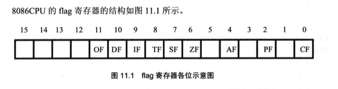
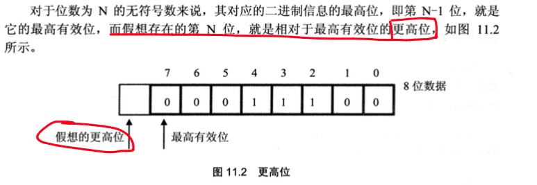
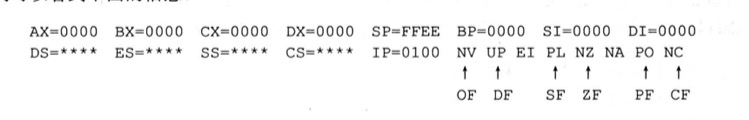

# 标志寄存器
CPU内部的寄存器中, 有一种特殊的寄存器(对于不同的处理机, 个数和结构都可能不同), 被称为标志寄存器(以后约定记为flag)

作用:
- 用来存储相关治理的某些执行结果
- 用来为CPU执行相关指令提供行为依据
- 用来控制CPU的相关工作方式

flag寄存器是按位起作用的, 它的每一位都有专门的含义, 记录特定的信息.



## ZF标志
flag的第6位是ZF: 零标志位.  记录相关指令执行后,其结果是否为0. 如果结果为0,那么zf=1(表示肯定); 如果结果不为0, 那么zf=0(表示否定)

```s
mov ax,1
sub ax,1    ;执行后结果为0, 则zf=1

mov ax,2
sub ax,1    ;执行后结果不为0, 则zf=0

mov ax,1
and ax,0    ;执行后结果为0, 则zf=1

mov ax,1
or ax,1     ;执行后结果不为0, 则zf=0
```
8086CPU指令中, 运算指令是影响标志寄存器的(如: add,sub,mul,div,inc,dec,or,and),传送指令不影响标志寄存器(如: mov,push,pop,jmp等)

## PF标志

flag的第2位是PF, 奇偶标志位. 它记录相关指令执行后,其结果的所有bit位中1的格式是否为偶数.如果1的个数是偶数,pf=1; 否则, pf=0
```s
mov al,1
add al,10     ;执行后,结果为00001011b, 其中有3(奇数)个1, 则pf=0

mov al,1
or al,2       ;执行后,结果为00000011b, 其中有2(偶数)个1, 则pf=1

sub al,al     ;执行后,结果为00000000b, 其中有0(偶数)个1, 则pf=1
```

## SF标志

flag的第7位是SF, 符号标志位. 它记录相关指令执行后, 其结果是否为负. 如果为负, sf=1; 如果非负, sf=0

计算机中通常用补码来表示有符号的数据. 对于同一个二进制数据, 计算机可以将它当做无符号数据来运算, 也可以当做有符号数据运算.
```s
mov al,10000001b
add al,1          ;结果: (al)=10000010b
                  ;如果当做无符号运算: 129+1=130(10000010b)
                  ;如果当做有符号运算: -127+1=-126(10000010b)
```

SF标志,是CPU对有符号数运算结果的一种记录, 它记录数据的正负. 将数据当做有符号数来运算的时候, 可以通过SF标志来得知结果的正负. 如果将数据当做无符号数来运算,SF的值没有意义.

```s
mov al,10000001b
add al,1      ;执行后结果100000010b, sf=1. 表示:如果进行的是有符号运算,结果为负

mov al,10000001b
add al,01111111b   ;执行后结果0, sf=0. 表示:如果进行的是有符号运算,结果非负
```

## CF标志

flag的第0位是CF, 进位标志位. 在进行**无符号数**运算时, 它记录了运算结果的最高有效位向更高位的进位值, 或从更高位的借位值.



当两个数据相加的时候, 有可能产生从最高位向更高位的进位. 比如`98h+98h`将产生进位.由于这个进位值在8位数中无法保存, 在以前的学习中,只是简单地说这个进位值丢失了.其实cpu在运算的时候,并不会丢弃这个进位值,而是记录在标志寄存器的某一位上. 8086cpu就用flag的CF位来记录这个值.

```s
  mov al,98h
  add al,al     ;执行后:(al)=30h, CF=1, CF记录了从最高有效位向更高位的进位值

  add al,al     ;执行后:(al)=60h, CF=0, CF记录了从最高有效位向更高位的进位值
```
当两个数相减时, 有可能向更高位借位. 如`97h-98h`将产生借位, 借位后相当于计算`197h-98h`. 而flag的CF位也可以用来记录这个借位值

```s
mov al,97h
sub al,98h      ;执行后: (al)=FFh, CF=1, CF记录了向更高位的借位值
sub al,al       ;执行后: (al)=0, CF=0, CF记录了向更高位的借位值
```

## OF标志

flag的第11位是OF, 溢出标志位. OF记录了`有符号数`运算的结果是否发生了溢出. 如果发生溢出, OF=1; 如果没有, OF=0;

CF和OF的区别: CF是对`无符号数`运算有意义的标志位; OF是对`有符号数`运算有意义的标志位

```s
 mov al,98
 add al,99      ;执行后 CF=0, OF=1. 对于无符号运算,98+99没有进位,CF=0; 对于有符号运算, 98+99发生溢出, OF=1

 mov al,0f0h
 add al,88h     ;执行后 CF=1, OF=1. 对于无符号运算,0f0+88有进位,CF=1; 对于有符号运算, f0+88发生溢出, OF=1

 mov al,0f0h
 add al,78h     ;执行后 CF=1, OF=0. 对于无符号运算,0f0+88有进位,CF=1; 对于有符号运算, f0+88不发生溢出, OF=0
```

## adc 指令
adc是带进位加法指令, 它利用了CF位上记录的进位值
- 指令格式: adc 操作对象1, 操作对象2
- 功能: 操作对象1 = 操作对象1 + 操作对象2 + CF
- 如`adc ax,bx`实现的功能为: (ax)=(ax)+(bx)+CF

```s
mov ax,2
mov bx,1
sub bx,ax
adc ax,1      ;执行后(ax)=4  adc执行时,相当于计算: (ax)+1+CF=2+1+1=4

mov ax,1
add ax,ax
adc ax,3      ;执行后(ax)=5  adc执行时,相当于计算: (ax)+3+CF=2+3+0=5

mov al,98h
add al,al
adc al,3      ;执行后(ax)=5  adc执行时,相当于计算: (ax)+3+CF=30h+3+1=34h

```
CF值的含义:
- 如果CF的值是被sub指令设置的, 那么它的含义就是借位值
- 如果是被add指令设置的,那么它的含义就是进位值

加法可以分为两步来进行:
1. 低位相加
2. 高位相加再加上低位相加产生的进位值
CPU提供adc指令的目的, 就是来进行加法的第二步运算的

以下指令和`add ax,bx`具有相同的结果
```s
add al,bl
adc ah,bh
```
编程, 计算`1ef000h+20100h`,结果放在ax(高16位)和bx(低16位)中.

分析: 先将低16位相加, 然后将高16位和进位值相加
```s
mov ax, 001eh
mov bx, 0f00h
add bx, 0100h
adc ax, 0200h
```

## sbb指令
sbb是带借位减法指令, 它利用了CF位上记录的借位值. sbb和adc是基于同样思想设计的两条指令
- 指令格式: sbb 操作对象1, 操作对象2
- 功能: 操作对象1=操作对象1-操作对象2-CF
- 如指令`sbb ax,bx`实现的功能是:`(ax)=(ax)-(bx)-CF`

利用sbb指令可以对任意大的数据进行减法运算. 如计算`003e1000h-00202000h`,结果放在ax,bx中:
```s
mov bx,1000h
mov ax,003eh
sub bx,2000h
sbb ax,0020h
```

## cmp指令
cmp是比较指令, cmp的功能相当于减法指令, 但是只对标志寄存器产生影响, 不保存结果.
- 指令格式: cmp 操作对象1, 操作对象2
- 功能: 计算`操作对象1-操作对象2`, 并对标志寄存器进行设置
```s
 mov ax,8
 mov bx,3
 cmp ax,bx      ;执行后(ax)=8, zf=0, pf=1, sf=0, cf=0, of=0
```
CPU在执行cmp指令时, 也包含两种含义: 进行`无符号数`运算和进行`有符号数`运算

以`cmp ah,bh`为例, 总结一下CPU执行cmp指令后, sf和of的值是如何来说明比较结果的

| sf和of结果 | 判断依据 | ah,bh的逻辑大小 |
| ---- | ---- | ---- |
| sf=1, of=0 | of=0 说明没有溢出, 逻辑上的正负=实际结果的正负 </br> sf=1说明实际结果为负 | (ah)<(bh) |
| sf=1, of=1 | of=1 说明有溢出, 逻辑上的正负≠实际结果的正负 </br> sf=1说明实际结果为负</br> **如果因为溢出导致了实际结果为负, 那么逻辑上真正结果必然为正**| (ah)>(bh) |
| sf=0, of=1 | of=1 说明有溢出, 逻辑上的正负≠实际结果的正负 </br> sf=0说明实际结果为非负 </br> **如果因为溢出导致了实际结果为正, 那么逻辑上真正结果必然为负**| (ah)<(bh) |
| sf=0, of=0 | of=0 说明没有溢出, 逻辑上的正负=实际结果的正负 </br> sf=0说明实际结果为非负 | (ah)≥(bh) |

## 检测比较结果的条件转移指令
因为cmp指令可以同时进行无符号数和有符号数的比较. 所以根据cmp指令的比较结果进行转移的指令也分为两种
- 根据`无符号数`的比较结果继续转移的条件转移指令(检测zf,cf的值)
- 根据`有符号数`的比较结果继续转移的条件转移指令(检测sf,of和zf的值)


无符号数的比较结果进行转移的条件转移指令:

| 转移指令 | 含义 | 检测相关标志位 |
| --- | --- | --- |
| je | 等于则转移 | zf=1 |
| jne | 不等于则转移 | zf=0 |
| jb | 低于则转移 | cf=1 |
| jnb | 不低于则转移 | cf=0 |
| ja | 高于则转移 | cf=0且zf=0 |
| jna | 不高于则转移 | cf=1或zf=1 |

如je,检测zf位,当zf=1的时候进行转移. 如果在je前面使用了cmp指令,那么je对zf的检测,实际上就是间接检测cmp的比较结果是否为两数相等

编程, 如果(ah)=(bh)则(ah)=(ah)+(ah)否则(ah)=(ah)+(bh)

```s
  cmp ah,bh
  je s
  add ah,bh
  jmp short ok
s:add ah,ah
ok:...
```
以上讨论的是根据无符号数的比较结果进行转移的条件指令. 根据有符号数的比较结果进行转移的条件指令的工作原理与无符号相同, 只是检测了不同的标志位.

## DF标志和串传送指令
flag的第10位是DF, 方向标志位. 在串处理指令中, 控制每次操作后si,di的增减. df=0  每次操作后si,di递增; df=1  每次操作后si,di递减.

- 格式: movsb
- 功能: 执行movsb指令相当于进行以下操作
1. `((es)*16+(di))=((ds)*16+(si))`
2. 如果df=0
    - (si)=(si)+1
    - (di)=(di)+1
3. 如果df=1
    - (si)=(si)-1
    - (di)=(di)-1
用汇编语法描述`movsb`功能如下:
```s
mov es:[di], byte ptr ds:[si]     ;8086并不支持这样的指令, 这里只是个描述
如果 df=0:
    inc si
    inc di
如果 df=1:
    dec si
    dec di
```
`movsb`的功能是将ds:si指向的内存单元中的`字节`送入es:di中, 然后根据标志寄存器df位的值, 将si和di递增或者递减

如果需要传送一个`字`, 使用指令`movsw`.
- 格式: movsw
- 功能: 将ds:si指向的内存字单元中的字送入到es:di中, 然后根据标志寄存器df位的值, 将si和di递增2或者递减2
用汇编语法描述`movsw`功能如下:
```s
mov es:[di], word ptr ds:[si]     ;8086并不支持这样的指令, 这里只是个描述
如果 df=0:
    add si,2
    add di,2
如果 df=1:
    add si,2
    add di,2
```

movsb和movsw进行的是串传送操作中的一个步骤, `movsb`和`movsw`都和`rep`配合使用
- 格式: rep movsb
用汇编语法描述`rep movsb`
```s
s: movsb
   loop s
```
rep的作用是根据cx的值, 重复指向后面的串传送指令.

同理可以使用`rep movsw`, 用汇编语法描述:

```s
s: movsw
   loop s
```
8086CPU提供`cld`和`std`指令对df位进行设置.
- `cld`指令: 将标志寄存器的df位置0
- `std`指令: 将标志寄存器的df位置1

编程, 用串传送指令, 将data段中的第一个字符串复制到它后面的空间中

```s
data segment 
  db 'Welcome to masm!'
  db 16 dup (0)
data ends

code segment
  mov ax, data
  mov ds, ax
  mov si, 0       ;ds:si指向data:0

  mov es, ax
  mov di, 16      ;es:di指向data:0010

  mov cx, 16      ;(cx)=16, rep循环16次
  cld             ;设置df=0, 正向传送
  rep movsb
code ends
```

编程, 用传送指令, 将f000h段中的最后16个字符复制到data段中
```s
data segment 
  db 16 dup (0)
data ends

code segment
  mov ax, data
  mov es, ax
  mov di, 15      ;es:di指向data:000f

  mov ax,0f000h
  mov ds,ax
  mov si,0ffffh   ;ds:si指向f000:ffff

  mov cx, 16      ;(cx)=16, rep循环16次
  std             ;设置df=1, 逆向传送
  rep movsb
code ends
```

## pushf和popf
pushf和popf为直接访问标志寄存器提供了一种方法

- pushf: 将标志寄存器的值压栈
- popf: 从栈中弹出数据, 送入标志寄存器

## 标志寄存器在debug中的表示
在debug中, 标志寄存器是按照有意义的各个标志位单独表示的.



| 标志 | 值为1的标记 | 值为0的标记 |
| --- | --- | --- |
| of | OV | NV |
| sf | NG | PL |
| zf | ZR | NZ |
| pf | PE | PO |
| cf | CY | NC |
| df | ND | UP |

## 实验11 编写子程序

描述如下
- 名称: letterc
- 功能: 将以0结尾的字符串中的小写字母转变成为大写字母
- 参数: ds:si指向字符串首地址

分析: 
1. 循环每一个字节, 直到为0
2. 小写字母的ASCII编码范围是[61,7a], 在此范围内的字节进行转换

```s
assume cs:code
data segment
  db "Beginner's All-purpose Symbolic Instruction Code.",0
data ends

code segment
  begin: mov ax,data
         mov ds,ax
         mov si,0
         call letterc

         mov ax,4c00h
         int 21h

  letterc: push ds
           push si
           push cx

        s: mov ch,0
           mov cl,ds:[si]           ;将ds:[si]设置到cx中
           jcxz ok                  ;如果(cx)=0,则退出
           
           cmp cx,61h
           jb next                  
           cmp cx,7ah
           ja next
           and cl,11011111b         ;将小写字母转换成大写
           
           mov ds:[si],cl           ;将大写字母回写到ds:[si]中
           
    next: inc si             ;si+1
          jmp short s        ;无条件转移到s处
       
       ok: pop cx
           pop si
           pop ds
           ret
code ends


end begin

```