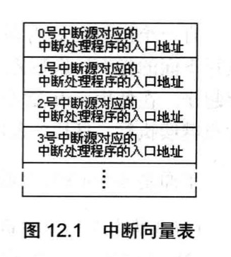

# 内中断
任何一个通用CPU(如8086)都具备一种能力, 可以在执行完当前指令之后, 检测到从CPU外部(或内部)产生的一种特殊信息, 并且立即对所接收到的信息进行处理.这种特殊的信息称为**中断信息**

中断信息可以来自cpu内部或外部, 这一章中, 主要讨论来自cpu内部的中断信息.

## 内中断的产生
8086CPU内部有以下情况发生时, 会产生相应的中断信息
1. 除法错误, 比如, 执行div指令产生的除法溢出
2. 单步执行
3. 执行into指令
4. 执行int指令

中断类型码: CPU首先要知道,中断信息的来源, 中断信息中必须包含识别来源的编码, 是一个`字节型`数据, 可以表示256种中断信息的来源.
中断源: 将产生中断信息的事件, 称为中断源

| 中断信息 | 中断类型码 
| --- | --- |
| 除法错误 | 0 |
| 单步执行 | 1 |
| 执行into指令 | 4 |
| 执行int指令 | 格式为`int n` <br/> 指令中的n为字节型立即数, 是提供给CPU的中断类型码|

## 中断处理程序

用来处理中断信息的程序称为中断处理程序, 一般来说, 需要对不同的中断信息编写不同的处理程序

中断信息中包含有标识中断源的类型码. 根据CPU的设计, 中断类型码的作用就是用来定位中断处理程序

## 中断向量表

CPU用8位的中断类型码通过中断向量表找到相应的中断处理程序的入口地址.

中断向量表在内存中保存, 其中存放着256个中断源所对应的中断处理程序的入口:



对于8086PC机, 中断向量表指定存放在内存地址0处, 从内存`0000:0000`到`0000:03ff`的1024个单元中存放着中断向量表. 
- 一个表项存放一个中断向量(中断处理程序的入口地址), 中断向量包括段地址和偏移地址.
- 一个表项占两个字, 高地址存放段地址, 低地址存放偏移地址

## 中断过程
CPU在收到中断信息后, 如果处理该中断信息, 就会完成一个由硬件自动执行的中断过程(程序员无法改变这个过程中所要做的工作).

8086CPU在收到中断信息后, 所引发的中断过程如下:
1. (从中断信息中)取得中断类型码: `N`
2. 标志寄存器的值入栈(在中断过程中要改变标志寄存器的值, 所以先将其保存在栈中): `pushf`
3. 设置标志寄存器的第8位TF和第9位IF的值为0: `TF=0, IF=0`
4. CS的内容入栈: `push CS`
5. IP的内容入栈: `push IP`
6. 从内存地址为`中断类型码*4`和`中断类型码*4+2`的两个字单元中读取中断处理程序的入口地址设置IP和CS: `(IP)=(N*4)`, `(CS)=(N*4+2)`

## 中断处理程序和iret指令
CPU随时都可能执行中断处理程序, 所以中断处理程序必须一直存储在内存某段空间之中.中断处理程序的入口地址, 即中断向量, 必须存储在对应的中断向量表表项中.

中断处理程序的编写方法和子程序比较类似, 常规步骤:

1. 保存用到的寄存器
2. 处理中断
3. 恢复用到的寄存器
4. 用iret指令返回
用汇编语法描述iret:
```s
pop IP
pop CS
popf
```
iret通常和硬件自动完成的中断过程配合使用.

## 除法错误中断的处理
当CPU执行div等除法指令的时候, 如果发生了除法溢出错误, 将产生中断类型码为0的中断信息.

## 编程处理0号中断
编程, 当发生除法溢出时, 在屏幕中间显示"overflow!", 返回DOS. 将这段程序称为`do0`

分析: 
1. `do0`应该存放在内存中, 因为除法溢出随时可能发生, CPU随时都可能将CS:IP指向`do0`的入口
2. 需要找到一块别的程序不会用到的内存区, 将`do0`传送到其中
3. 内存`0000:0000~0000:3fff`,大小为1kb的空间是系统存放中断处理程序入口地址的中断向量表.8086支持256个中断(每个4字节). 实际上, 系统中要处理的中断事件远没有达到256个, 所以在中断向量表中, 有许多单元是空的.
4. 可以利用中断向量表中的空闲单元来存放我们的程序. 一般情况下, 从`0000:0200~0000:02ff`的256个字节的空间对应的中断向量表项都是空的,操作系统和其他应用程序都不占用
5. 可以将`do0`传送到内存`0000:0200`处

结论:
1. 编写可以展示`"overflow!"`的中断处理程序: do0
2. 将do0送入内存0000:0200处
3. 将do0的入口地址,0000:0200存储在中断向量表0号表项中

```s
assume cs:code

code segment

  start:do0安装程序
        设置中断向量表
        mov ax,4c00h
        int 21h

  do0:  显示字符串"overflow!"
        mov ax,4c00h
        int 21h

code ends

end start
```

### 安装
使用movsb指令, 将do0的代码送入0:200处.

分析步骤:
1. 设置es:di指向目的地址
    - 0:200
2. 设置ds:si指向源地址
    - 段地址cs, 偏移地址 offset do0
3. 设置cx为传输长度
    - do0部分代码长度
    - 长度计算:`mov cx, offset do0end-offset do0`. 此代码中的`-`是编译器识别的运算符号, 编译器可以用它来进行两个常数的减法
4. 设置传输方向为正
5. 执行`rep movsb`

```s
assume cs:code

code segment

  start:mov ax,0
        mov es,ax
        mov di,200h           ;设置es:di指向目的地址

        mov ax,cs
        mov ds,ax
        mov si, offset do0    ;设置ds,si指向原地址
        mov cx, offset do0end-offset do0
        cld
        rep movsb

        设置中断向量表
        mov ax,4c00h
        int 21h

  do0:  显示字符串"overflow!"
        mov ax,4c00h
        int 21h

do0end: nop

code ends

end start
```

### do0
do0程序的主要任务是显示字符串

分析:
1. 设置ds:si指向字符串
    - 字符串`overflow!`应该保存到`do0`程序段中
    - 段地址: 发生除法溢出时, CS中必然存放do0的段地址, 即`overflow!`的段地址
    - 偏移地址: `0:200`处的指令为`jmp short do0start`,这个指令占2个字节, 所以`overflow!`的偏移地址为202h
2. 设置es:di指向显存单元
    - 显示缓冲区的段地址: b800
    - 偏移地址(12行,18列): `160*12 + 36*2`
3. 循环写入
4. 写完之后退出到DOS

```s
do0: jmp short do0start
     db 'overflow!'
     
do0start:
     mov ax,cs
     mov ds,cs
     mov di,0202h           ;设置ds:si指向字符串

     mov ax,0b800
     mov es,ax
     mov di,160*12+36*2     ;设置es:di指向显存空间的中间位置
     
     mov cx,9               ;设置字符串长度
  s: mov al, ds:[si]
     mov es:[di], al
     inc si
     add di,2
     loop s

     mov ax,4c00h
     int 21h
```

## 设置中断向量
目的: 将`do0`的入口地址`0:200`写入中断向量表的0号表项中, 使`do0`成为0号中断的中断处理程序

分析: 0号表项的地址是`0:0`, 其中`0:0`字单元存放偏移地址, `0:2`字单元存放段地址

```s
mov ax,0
mov es,ax
mov word ptr es:[0*4],200h
mov word ptr es:[0*4+2],0
```

## 单步中断
CPU在执行完一条指令后, 如果检测到标志寄存器的TF位为1, 则产生单步中断, 引发中断过程.

中断过程:
1. 取得中断类型码1
2. 标志寄存器入栈, TF,IF设置为0
3. CS,IP入栈
4. `(IP)=(1*4),(CS)=(1*4+2)`
CPU提供单步中断功能的原因就是, 为单步跟踪程序的执行过程, 提供了实现机制

## 响应中断的特殊情况
在有些特殊情况下, CPU执行完当前指令后, 即使发生中断, 也不会响应. 

在执行完想ss寄存器传送数据的指令后, 即便是发生中断, CPU也不会响应. 

## 实验12 编写0号中断的处理程序
编写0号中断的处理程序, 使得在除法溢出时, 在屏幕中间显示字符串`divide error!`然后返回到DOS

```s
assume cs:code

code segment

  start:mov ax,0
        mov es,ax
        mov di,200h           ;设置es:di指向目的地址

        mov ax,cs
        mov ds,ax
        mov si, offset do0    ;设置ds,si指向原地址
        mov cx, offset do0end-offset do0
        cld
        rep movsb

        mov ax,0
        mov es,ax
        mov word ptr es:[0*4],200h
        mov word ptr es:[0*4+2],0


        mov ax,4c00h
        int 21h

do0: jmp short do0start
     db "divide error!"
     
do0start:
     mov ax,cs
     mov ds,ax
     mov si,0202h           ;设置ds:si指向字符串

     mov ax,0b800h
     mov es,ax
     mov di,160*12+33*2     ;设置es:di指向显存空间的中间位置
     
     mov cx,0dh               ;设置字符串长度
  s: mov al, ds:[si]
     mov ah, 2              ;设置为绿色
     mov es:[di], ax
     inc si
     add di,2
     loop s

     mov ax,4c00h
     int 21h

do0end: nop

code ends

end start
```